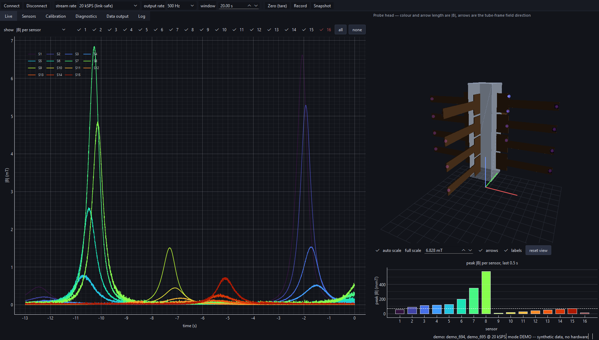
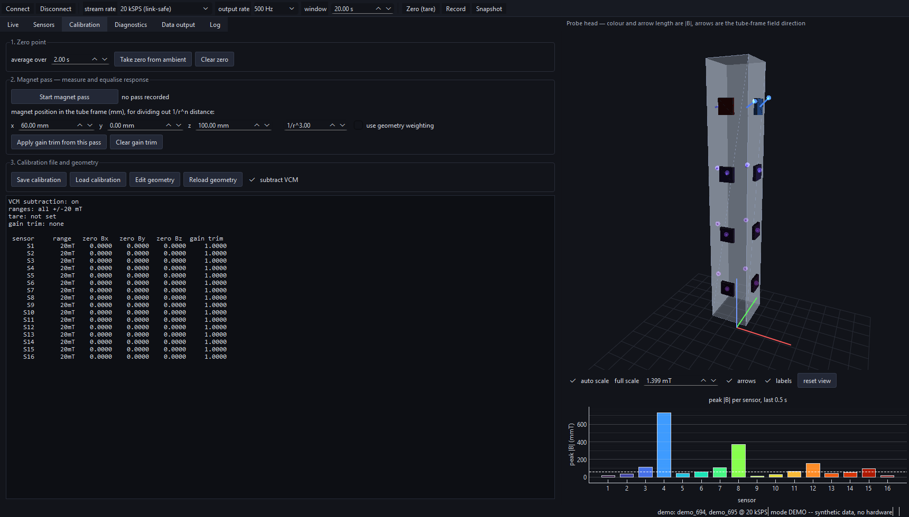

# OCTO-BEE Hall probe — setup, live view, and calibration

Tooling that replaces the Phoebus Data Browser round-trip for the 16-sensor
3D Hall probe, plus what the hardware actually reports today.

Everything here was verified against the live hardware on 2026-08-19.

---

## 1. What the system actually is

You have **two** carriers, not one. That is why you were only ever seeing 32
channels: Phoebus was pointed at one box.

| carrier | IP | ACQ423 s/n | sensors | stream frame |
|---|---|---|---|---|
| `acq1001_694` | 192.168.1.82 | E42310297 | S1–S8 | 96 B (24 LW), 1 encoder word |
| `acq1001_695` | 192.168.1.83 | E42310298 | S9–S16 | 104 B (26 LW), 3 encoder words |

Both: ACQ423ELF, 32 ch, 16-bit packed, ±10 V, 200 kSPS, SPAD = 7 longwords.
The two boxes have **different frame layouts**, so anything that decodes the raw
stream has to read the geometry off the box rather than hard-code it. The tools
here do that.

The carriers are **not** synchronised — each free-runs on its own oscillator
(measured 200001 Hz vs 199999 Hz). The two halves of the probe drift relative to
each other by about 1 sample per 100 k. Fine for amplitude work, not for phase.

### Channel map

Per box, each SENIS eval kit takes 4 consecutive ACQ423 channels:

```
ch 4k+1 = Bz    ch 4k+2 = By    ch 4k+3 = Bx    ch 4k+4 = VCM
```

so kit 1 → ch 1–4, kit 2 → ch 5–8, … kit 8 → ch 29–32, on each box.

**VCM is not a field channel.** It is that chip's own virtual-ground reference
(~2.2 V), and it must be subtracted from that same chip's Bx/By/Bz before any
field number is quoted. The 16 chips' VCMs differ by up to ~90 mV.

This map comes from the OCTO-BEE guide §3.7. It is documentation, not
measurement — confirm it on your hardware with `octobee_idmap.py` (§4).

---

## 2. Quick start

```bash
python octobee.py info                  # live config + channel map, both boxes
python octobee_live.py                  # LIVE PLOT, all 16 sensors, one window
python octobee_cal.py --seconds 5       # health + calibration report
```

`octobee_live.py` modes:

| flag | view |
|---|---|
| *(default)* `--mode stack` | 48 field traces stacked, labelled `S1 Bz` … `S16 Bx` |
| `--mode overlay` | all traces on one pair of axes — use this to compare spike heights |
| `--mode grid` | one subplot per sensor, with a black \|B\| trace |
| `--show-vcm` | adds the 16 VCM references |
| `--range 20` | y-axis in mT instead of volts |

### Sample rate while streaming live

The boxes produce 19.2 MB/s each at 200 kSPS, but the Ethernet link to this PC
measures **9.8 MB/s**. A sustained 200 kSPS live stream therefore cannot keep up.
`octobee_live.py` drops the ADC clock to 20 kSPS while it runs (`--fs`) and puts
the original clock back on exit; measured broadband noise is unchanged, and a
hand-passed magnet is a sub-Hz signal anyway.

Short offline captures at the full 200 kSPS are unaffected — the box buffers and
delivers every sample, just slower than real time. A 2 s capture from both boxes
came back with **zero** lost samples.

If a live session is killed rather than closed, the reduced clock is left in
place. Undo it with:

```bash
python octobee.py restore        # puts both boxes back to 200 kSPS
python octobee.py info           # confirm
```

### Phoebus interaction

Phoebus' *Streaming Capture* button starts a `CONTINUOUS` stream that owns the
data mover; while it runs, port 4210 gives an immediate EOF. All the tools here
stop it automatically. To go back to Phoebus, just press its start button again.

---

## 3. What the hardware is telling us right now

From a 2 s capture of both boxes, ambient field, no magnet:

**Dead sensor.** `acq1001_695` ch29/30/32 (S16 Bz, By, VCM) are pinned at
−32768 counts — negative full scale, zero variance. ch31 (Bx) reads normally.
Three of four lines dead but one alive points at the port-8 ribbon/connector on
that concentrator, not a dead chip. **Fix this before calibrating.**

**Noise rises steadily along the ribbon.** The VCM channel carries no field, so
its noise is pure analog-path pickup. Per box it climbs monotonically with port
number:

```
694 VCM noise [counts]:  S1 0.52  S2 0.54  S3 0.55  S4 1.26
                         S5 0.97  S6 2.00  S7 3.33  S8 12.47
695 worst:               S9 13.26   (S9 field channels: 136–311 counts std)
```

That is a cabling/grounding signature — longer runs and later connector
positions picking up more. It is not a sensor calibration problem, and no amount
of gain trimming will fix it. Worth reseating and checking the ribbon
grounding on the high-numbered ports.

**VCM spread.** 2.2324 V (S1) down to 2.1420 V (S8). ~90 mV = ~295 counts =
about 1.4 mT of *apparent* field at the 20 mT range if you plot raw channels.
This shifts baselines, not amplitudes — but it will wreck any absolute reading.

**ASIC temperatures look wrong.** Several read 8–14 °C, below plausible room
temperature. Either the AMUX channel mapping on the CELF differs from the guide,
or those inputs are not connected. Treat the temperature column as unverified.

**PWR_GOOD** reads `0xff000fff` (694) and `0xffffff00` (695), not `0xffffffff`.
Per the guide it only latches at boot, so it may be stale — but it is worth a
reboot to see whether it agrees with the S16 fault.

**The two boxes' chips are configured differently.** `octobee_cal.py` includes an
SPI-free check for this. The VCM channel is the control: it leaves the same
package, travels the same ribbon into the same ADC, but carries no Hall signal
and no amplifier gain. So `noise(field) / noise(VCM)` isolates the amplifier
chain with the shared cable pickup divided out. On the sensors whose VCM is
clean:

```
acq1001_694  S1 14.9   S2 15.2   S3 14.2   S5  9.3        median 14.5
acq1001_695  S10 20.9  S11 27.2  S12 26.3  S13 38.6  S14 28.4  S15 28.8   median 27.8
```

A consistent **1.9×** split between the boxes, with matching VCM noise. That is a
register difference — amplifier gain (`G_CTRL_X/Z/Y`) and/or low-pass corner
(`PWM_CTRL` bits 5:4) — not cabling. A chip at higher gain gives a proportionally
bigger spike for the same field. Sensors whose VCM is already noisy (S4, S6–S9)
cannot be assessed this way; the report says so rather than guessing.

### SPI audit, acq1001_694 (S1–S8)

Measured over SPI on the carrier. **Within this box the configuration is
uniform** — the chips are not set up differently from each other:

```
amplifier gain     1500  on all 8   -> +/-40 mT range, 34.65 V/T
PWM_CTRL              0  on all 8   -> LPF 100 kHz, same on every chip
CHANNEL_CTRL        127  on all 8   -> X, Z, Y and temperature all enabled
EEPROM key         0xa5  on all 8   -> factory calibration IS loaded
STATUS             0x1c  on all 8   -> no checksum error, no invalid key
chip temperature   21.4 .. 32.5 C   -> plausible, unlike the SPAD TCH values
```

The per-chip trims *do* differ, and that is correct — they are the factory
calibration compensating each Hall element:

```
DAC_X (Bx bias)  13..16  =  2.02-2.38 mA   18% spread
DAC_Z (Bz bias)  18..21  =  2.61-2.96 mA   13% spread
DAC_Y (By bias)  13..16  =  2.02-2.38 mA   18% spread
```

Those match the datasheet's nominal 2.2 mA (vertical) / 2.6 mA (horizontal)
bias. Differing values here are what make the chips *agree*, not what makes them
disagree — an earlier version of the audit flagged them as faults, which was
wrong, and the script now separates "configuration that must match" from
"calibration trim that is expected to differ".

Three real anomalies did show up, where a trim has dropped to zero while every
sibling is ~130–205:

```
SENS_Y = 0 on S4      SENS_Z = 0 on S8      SENS_Y = 0 on S8
```

`SENS` bit 7 clear means *auto linearity control* instead of *manual fine gain*,
so those three axes are in a different sensitivity-correction mode from the other
21. The fine-gain trim is only 0.05 %/LSB (a few percent overall), so this is a
small effect — but it is a genuine per-axis calibration difference.

### SPI audit, acq1001_695 (S9–S16) — and the root cause

```
S9 : gain=3000  G_CTRL_X=0  EEkey=0xa5  DAC=[11,16,12]  T=34.5 C
S10: gain=3000  G_CTRL_X=0  EEkey=0xa5  DAC=[12,16,12]  T=31.3 C
S11: gain=3000  G_CTRL_X=0  EEkey=0xa5  DAC=[12,15,12]  T=31.4 C
S12: gain=3000  G_CTRL_X=0  EEkey=0xa5  DAC=[12,16,13]  T=28.8 C
S13: gain=3000  G_CTRL_X=0  EEkey=0xa5  DAC=[12,16,13]  T=31.4 C
S14: gain=3000  G_CTRL_X=0  EEkey=0xa5  DAC=[13,17,13]  T=30.0 C
S15: gain=3000  G_CTRL_X=0  EEkey=0xa5  DAC=[13,16,13]  T=24.5 C
S16: gain=3000  G_CTRL_X=0  EEkey=0xa5  DAC=[12,17,12]  T=29.2 C
```

**The two halves of the probe are running at different gains.**

| carrier | sensors | `G_CTRL` | gain | range | sensitivity |
|---|---|---|---|---|---|
| `acq1001_694` | S1–S8 | 1 | 1500 | ±40 mT | **34.65 V/T** |
| `acq1001_695` | S9–S16 | 0 | 3000 | ±20 mT | **63 V/T** |

63 / 34.65 = **1.82×**. The same magnet at the same distance produces a spike
1.82× taller on S9–S16 than on S1–S8, purely from the gain setting. That matches
the 1.9× the noise-ratio check predicted from the data alone, before any SPI
access — two independent routes to the same number.

This is the main instrument-side answer to "why are the spikes different
heights". It is not a broken calibration: every chip has a valid EEPROM key
(`0xa5`) and sensible per-chip trims. The two boxes were simply configured on
different ranges.

**Also: S16's chip is alive.** It answers on SPI, reports gain 3000, a valid
EEPROM key and 29.2 °C. So the fault behind the railed ch29/30/32 is purely in
the **analog** path — the eval-kit-to-concentrator ribbon for port 8 — since SPI
and analog take different routes. The chip and its power are fine.

#### Fixing it

Pick one range for all 16 and apply it everywhere. The choice depends on the
largest field any sensor will see:

- **±20 mT (gain 3000)** — best resolution, but clips above 20 mT.
- **±40 mT (gain 1500)** — half the sensitivity, twice the headroom.

```bash
# make everything ±40 mT (matches the current 694 setting)
"$PUTTY/plink.exe" -ssh -batch -pw "$PW" -hostkey "$HK" root@acq1001_695 \
    'python3 /tmp/onbox_sensor_audit.py --set-gain 1500'
```

This writes registers only, so it is **lost at power cycle**. Make it permanent
by writing the same values to EEPROM and calling `activate_EEPROM_config()`, or
by applying it from `rc.user` at boot (OCTO-BEE guide Appendix B.4.2).

Until they are harmonised, tell the analysis the truth per box:

```bash
python octobee_cal.py --range 40 --range 20      # 694 then 695, in --uut order
```

### A library bug to know about

`get_meas_range()` returns `'400 mT'` while `get_gain()` returns `1500`, and the
library's own `GainMeasRangeDict` maps `1500 -> '40 mT'`. The datasheet is
unambiguous (Table 22: `G_CTRL` bits 1:0 = 01 → gain 1500; Table 21: gain 1500 →
±40 mT), and the register reads `G_CTRL_* = 1`. **Trust `get_gain()`, not
`get_meas_range()`** — at ±40 mT the sensitivity is 34.65 V/T, a factor of ten
away from what the range string implies. Getting this wrong scales every field
number by 10.

---

## 4. Calibration procedure

### The geometry problem

The 16 sensors are mounted on a square tube, 4 per face, pointing outwards. Two
consequences dominate everything else:

1. **Every chip has a different orientation.** A chip on face 1 and a chip on
   face 3 are rotated 180° about the tube axis, so their `Bx` point in opposite
   lab directions. *Comparing a single axis across sensors is meaningless.*
   Compare `|B| = √(Bx²+By²+Bz²)`, which is rotation-invariant. The tools do.

2. **"Same distance from the probe" is not the same distance from each sensor.**
   A magnet held at a fixed point sits at very different distances from sensors
   on the near face and the far face, and at different distances from the four
   positions along a face. Field from a small magnet falls off roughly as 1/r³,
   so a 10 % distance error is a 30 % amplitude error. **This alone can produce
   the unequal spike heights you are seeing, with perfectly calibrated sensors.**

So the calibration has to present the magnet *per sensor*, normal to that
sensor's own face, at a fixed distance from that sensor's package centre. The
field-sensitive volume is at the centre of the QFN28 package, 100 × 100 × 10 µm.

### Step 0 — fix the hardware first

Repair the S16 port. Reseat the high-numbered ribbons. Re-run
`python octobee_cal.py --seconds 5` and confirm all 16 sensors show VCM noise
below ~1 count before going further. Calibrating over a cabling fault just bakes
the fault into your coefficients.

### Step 1 — make the chips identical (this is the likely culprit)

Gain, Hall bias current and EEPROM calibration status live inside the ASIC and
are reachable only over SPI from the carrier. A chip at gain 1500 gives exactly
half the response of one at 3000, for the same field.

```bash
scp onbox_sensor_audit.py root@acq1001_694:/tmp/
ssh root@acq1001_694 'python3 /tmp/onbox_sensor_audit.py'
ssh root@acq1001_695 'python3 /tmp/onbox_sensor_audit.py'
```

The root password is the one on the printed sheet that shipped with the units
(D-TACQ manual §"The root password is provided on a printed sheet with your
shipment"); both carriers use the same one. OpenSSH on this PC prompts
interactively, which does not work from a script — PuTTY is installed and takes
the password on the command line:

```bash
PUTTY="/c/Program Files/PuTTY"
HK=SHA256:51adMhUSu461QXQICNZfCpfA81hV1nomlMNQPhKaq3M    # acq1001_694 host key
"$PUTTY/pscp.exe"  -batch -pw "$PW" -hostkey "$HK" onbox_sensor_audit.py root@acq1001_694:/tmp/
"$PUTTY/plink.exe" -ssh -batch -pw "$PW" -hostkey "$HK" root@acq1001_694 'python3 /tmp/onbox_sensor_audit.py'
```

Better still, install a key once and drop the password entirely
(D-TACQ manual, "Now ssh logins are automatic, no password required"):

```bash
ssh-keygen -t ed25519            # if you have no key yet
ssh-copy-id root@acq1001_694
ssh-copy-id root@acq1001_695
```

The SPI library lives at `/usr/local/senm3dx/ThreeDHALLInterface.py` on the
carrier, not `/usr/local/CARE` as the OCTO-BEE guide implies; the audit script
puts both on `sys.path`.

The audit takes a couple of minutes per box — `verify_spi_interface(100)` does
100 SPI round trips per chip before anything is read.

Read the `!!` lines. They flag any register that differs between chips:
`gain`, `DAC_X/Z/Y` (bias current = sensitivity), `SENS_*` (fine gain), and
**`EE valid`** — if a chip's EEPROM key/checksum is invalid the factory
calibration is *not loaded* and it runs on datasheet defaults.

To harmonise gain across a box:

```bash
ssh root@acq1001_694 'python3 /tmp/onbox_sensor_audit.py --set-gain 3000'
```

That writes registers only, so it is lost at power cycle. Make it permanent by
writing the same values to EEPROM and calling `activate_EEPROM_config()`.

### Step 2 — verify the channel map

```bash
# terminal 1
ssh root@acq1001_694 'python3 /tmp/onbox_sensor_audit.py --id-sweep 4'
# terminal 2, started right after
python octobee_idmap.py --uut acq1001_694 --seconds 70
```

The sweep mutes each sensor's Bx/By/Bz in turn over SPI; the host tool reports
which ACQ423 channels went quiet, in order, and prints CONFIRMED or the measured
map. No clock sync needed — only the order matters. Repeat for `_695`.

### Step 3 — build the physical map

SPI position ≠ position on the tube. Pass a magnet slowly along one face:

```bash
python octobee_idmap.py --uut acq1001_694 --seconds 60 --magnet
```

It ranks the sensor groups by when they peaked, which is the physical order.
Record the result as a table: *tube face × position → sensor → channels*.

### Step 4 — zero-field offsets

Capture with no magnet nearby and the probe away from anything ferrous:

```bash
python octobee.py capture --seconds 10 -o zero_field.npz
python octobee_cal.py --load zero_field.npz
```

The `off Bz/By/Bx` columns are each axis' residual offset after VCM subtraction.
Store them as your offset table. For a proper zero you want either a zero-gauss
chamber, or the flip method: rotate the probe 180° and average the two readings,
which cancels the ambient field and leaves the offset.

### Step 5 — cross-calibration

With gains harmonised and offsets known, present the *same* magnet to each
sensor in turn, normal to that sensor's face, at a fixed distance — use a
machined spacer or jig so the geometry repeats to well under a millimetre.

```bash
python octobee_cal.py --seconds 20 --range 20 --plot
```

The report gives each sensor's peak `|B|` and its ratio to the median. Those
ratios are your per-sensor scale factors `k_i = B_ref / |B|_i`. After Step 1 they
should land inside a few percent; anything still outside ±10 % means that chip's
EEPROM calibration is suspect or its mounting differs.

### Step 6 — absolute scale and orientation (when you need lab-frame vectors)

Relative cross-calibration is all you can get from a hand-held magnet. For
absolute field and a common coordinate frame you need a known uniform field —
a Helmholtz coil large enough to swallow the tube, or a calibrated reference
magnetometer:

- **Absolute scale:** apply a known `B`, read each sensor, `k_i = B_known/|B|_i`.
- **Orientation matrix `R_i`:** with the tube in a known uniform field, each
  sensor's (Bx,By,Bz) is `R_i` applied to that field. Repeat for three
  independent field directions (or rotate the tube about its axis to three known
  angles) and solve for `R_i` per sensor. After that every sensor reports in the
  tube frame and the four faces become directly comparable.
- Log `TCH1..8` alongside — sensitivity TC is <100 ppm/°C, so a 10 °C spread is
  a 0.1 % effect, small but free to record.

### Worth doing anyway: use the ADC range

The ACQ423 is set to ±10 V but the SENIS analog output only spans 0.125–4.380 V.
Switching to the `0-5V` range gives 4× finer resolution for free:

```bash
python -c "import octobee as ob; u=ob.Uut('acq1001_694'); print(u.cmd('GAIN:ALL 0-5V',1)); u.close()"
```

At 20 mT range that takes the quantisation from 4.8 µT/count to 1.2 µT/count.
Verify VCM still reads ~2.2 V afterwards.

---

## 5. Files

| file | runs on | purpose |
|---|---|---|
| `octobee.py` | PC | core library: UUT knobs, frame decode, capture. `info` / `capture` / `restore` CLI |
| `octobee_live.py` | PC | live plot of all 16 sensors, both boxes, one window |
| `octobee_cal.py` | PC | health + calibration report, optional PNG |
| `octobee_idmap.py` | PC | proves the channel↔sensor map (SPI sweep or magnet pass) |
| `onbox_sensor_audit.py` | **carrier** | SPI register audit of all 8 chips; `--id-sweep`, `--set-gain` |
| `octobee_gui.py` | PC | the application: live view, 3D probe head, calibration, exports |
| `probe_geometry.py` | PC | chip positions and per-chip rotation matrices on the tube |
| `probe_view3d.py` | PC | the 3D probe-head widget |
| `octobee_calibration.py` | PC | counts → tesla, tare, gain trim, channel health |
| `octobee_record.py` | PC | CSV / raw / report writers |
| `selftest.py` | PC | end-to-end verification, offline or against the hardware |

The command-line tools need only `numpy` and `matplotlib`. The GUI additionally
needs `PyQt6`, `pyqtgraph` and `PyOpenGL` — `pip install -r requirements.txt`.
Nothing else in either case: no HAPI install, no Phoebus, no EPICS.

---

## 6. The GUI

```bash
pip install -r requirements.txt

python octobee_gui.py                       # the two carriers
python octobee_gui.py --demo                # synthetic probe, no hardware
python octobee_gui.py --replay captures/ambient_test.npz
```

One window, built on the same `octobee.py` decode path as the CLI tools. The
left half carries the work — live traces, the per-sensor table, calibration,
diagnostics, exports — and the right half always shows the probe head in 3D
with a peak-|B| bar chart underneath, so the state of all 16 sensors is visible
whatever tab you are on.


*Live, both carriers, no magnet. S16 is excluded automatically and dropped from
the legend; the bar chart ranks the rest by peak |B| and reproduces the known
noise pattern — S9 worst, then S15, S13 and S8.*

### Why a 3D view rather than more plots

The chips point in 16 different directions, so a stack of 48 traces cannot show
you where a field actually is. The 3D view rotates each chip's vector into the
common tube frame with the matrices from `probe_geometry.py` and draws it where
that chip physically sits. A magnet passing the probe then reads directly: which
face it went past, in which direction the field pointed, and — because every
arrow shares one scale — which sensors answered more strongly than their
neighbours.

Colour and arrow length are |B|, which is rotation-invariant and therefore the
only amplitude that can honestly be compared between chips. Excluded chips are
drawn dark red with no arrow.



*A magnet travelling along the probe (`--demo`). Each sensor answers in turn,
and the arrows on the 3D model track it.*

### The calibration sequence

1. **Connect.** Drops the ADC clock to 20 kSPS so the link keeps up, and puts
   the original `clkdiv` back on disconnect. It waits until *both* carriers are
   actually delivering before reporting success.
2. **Zero (tare)** with no magnet near the probe. Stores each axis of each chip's
   ambient reading as its zero point.
3. **Magnet pass.** Start it, move the magnet along the probe, stop it. The peak
   |B| per sensor is recorded against the baseline from when the pass started.
4. If the magnet was not equidistant from every chip — it never is — tick
   **use geometry weighting** and enter its position. That divides out the
   1/r³ distance term, which on this tube is worth a factor of ~200 on its own.
   Whatever spread survives that is electrical: gain register, EEPROM
   calibration, or Hall bias current.
5. **Apply gain trim** to equalise what is left, then **Save calibration**.



Each sensor's measurement range is set per row in the Sensors tab, not globally,
because on this probe the two halves genuinely differ: the SPI audit in section 3
found S1-S8 at gain 1500 (+/-40 mT, 34.65 V/T) and S9-S16 at gain 3000
(+/-20 mT, 63 V/T). The shipped `calibration.json` already encodes that, so the
1.82x is removed where it belongs -- at the volts-to-tesla conversion -- instead
of being absorbed into a gain trim that would hide it. If the boxes are ever
harmonised with `--set-gain`, update that file to match.

If `calibration.json` is missing the GUI falls back to +/-20 mT for everything
and says so in the Log, because that would silently scale S1-S8 by 1.82x.

### Data output

| what | format | rate |
|---|---|---|
| **Record** → calibrated CSV | millitesla, one column per axis plus \|B\|, with a provenance header | the output rate, default 500 Hz |
| **Record** → raw | flat `int16` `.bin` + `.json` sidecar, wire order, nothing subtracted | the full stream rate |
| **Snapshot** | `.npz`, lossless | the carriers' own 200 kSPS |

The raw route exists so that a capture taken today survives a later correction
to the channel map, the VCM handling or the gain registers. The snapshot puts
the carriers' clock back to full rate first, takes the capture, and leaves them
there — a short capture is buffered and delivered complete even though a
sustained one could not be.

Tick **rotate into the common tube frame** to get components that can be
compared between sensors. Unticked, each chip's Bx/By/Bz are its own and only
|B| is comparable.

### Diagnostics stay on screen

The per-sensor table and the Diagnostics tab report all 64 raw channels, and
sensors whose channels are railed or stuck are excluded from every statistic,
scale and export automatically. A chip whose **VCM reference** is broken counts
as dead even when its other channels look plausible, because every axis it
reports is quoted relative to that reference — which is exactly how S16
presents on this probe.

Read the VCM rows first when hunting noise. VCM carries no field, so noise on it
is analogue pickup in the cabling and grounding rather than a sensor problem.

### The probe geometry

The chips are not on the tube: each rides at the tip of a 92 mm SENIS eval-kit
PCB standing off radially, so its field sensitive volume sits **89 mm clear of
the face** it is bolted to (3 mm in from the board's tip, 0.55 mm above the
board surface). With a 40 mm tube that puts every chip 109 mm from the tube
axis and 218 mm from the chip opposite it.

That standoff is the single biggest geometric fact about this instrument. A
magnet 20 mm off one chip is ~240 mm from the far side, and 1/r^3 turns that
into a **~1800x** difference in what they read from the same magnet. Any
comparison of spike heights has to divide it out before blaming a register --
which is what *use geometry weighting* on the Calibration tab does.

### The geometry file is an assumption

`probe_geometry.json` holds the tube and arm dimensions and which sensor sits on
which face, and carries that warning in its own `notes` field. The arm
dimensions come from the vendor drawing and are solid; the tube width, the
mounting-plate pitch, the board orientation and above all the sensor-to-face
mapping are not yet confirmed. **The face assignment has not been verified on this hardware.** Only the
3D view's arrangement and the tube-frame rotation depend on it — |B|, the health
diagnostics and the raw exports do not. Fix it with `octobee_idmap.py` and a
slow magnet pass along one face, then press *Reload geometry*.

### Verifying it still works

```bash
python selftest.py                     # synthetic probe, no hardware
python selftest.py --replay captures/ambient_test.npz
python selftest.py --live              # against the real carriers
```

It drives the whole pipeline and then reads the written files back to check the
numbers, rather than checking that files merely exist. The live run also asserts
that no blocks were dropped and that the carriers are left at the clock they
were found at.
