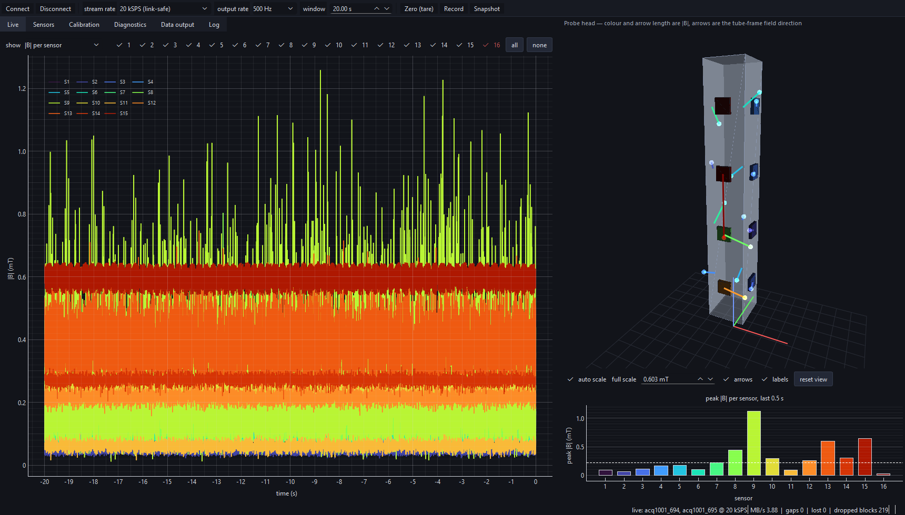
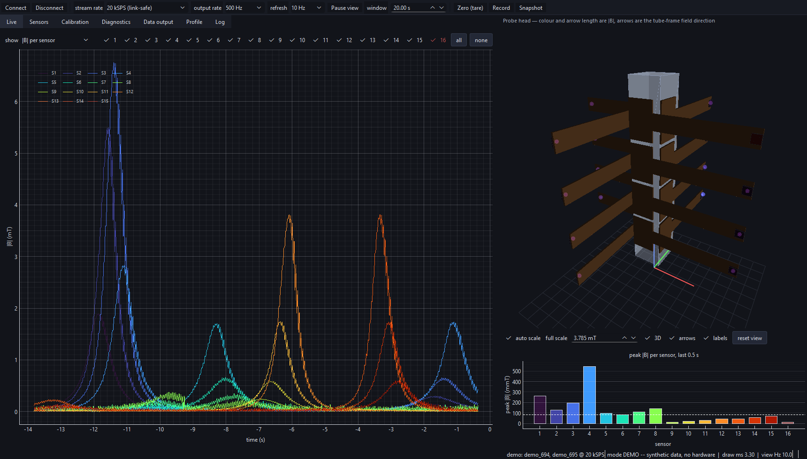

# OCTO-BEE Hall probe — setup, live view, and calibration

Tooling that replaces the Phoebus Data Browser round-trip for the 16-sensor
3D Hall probe, plus what the hardware actually reports today.

Everything here was verified against the live hardware on 2026-08-19.

---

## 1. What the system actually is

You have **two** carriers, not one. That is why you were only ever seeing 32
channels: Phoebus was pointed at one box.

| carrier | IP | ACQ423 s/n | sensors | stream frame |
|---|---|---|---|---|
| `acq1001_694` | 192.168.1.82 | E42310297 | S1–S8 | 96 B (24 LW), 1 site-2 word (**not** an encoder) |
| `acq1001_695` | 192.168.1.83 | E42310298 | S9–S16 | 104 B (26 LW), 3 encoder words (ENC_X/Y/Z) |

Both: ACQ423ELF, 32 ch, 16-bit packed, ±10 V, 200 kSPS, SPAD = 7 longwords.
The two boxes have **different frame layouts**, so anything that decodes the raw
stream has to read the geometry off the box rather than hard-code it. The tools
here do that.

The asymmetry is not cosmetic: only 695 has quadrature-encoder logic in its
FPGA, so only 695 can read an encoder at all. See *The encoders* in section 9.

The carriers are **not** synchronised — each free-runs on its own oscillator
(measured 200001 Hz vs 199999 Hz). The two halves of the probe drift relative to
each other by about 1 sample per 100 k. Fine for amplitude work, not for phase.

### Channel map

Per box, each SENIS eval kit takes 4 consecutive ACQ423 channels:

```
ch 4k+1 = Bz    ch 4k+2 = By    ch 4k+3 = Bx    ch 4k+4 = VCM
```

so kit 1 → ch 1–4, kit 2 → ch 5–8, … kit 8 → ch 29–32, on each box.

**VCM is not a field channel.** It is that chip's own virtual-ground reference
(~2.2 V), and it must be subtracted from that same chip's Bx/By/Bz before any
field number is quoted. The 16 chips' VCMs differ by up to ~90 mV.

This map comes from the OCTO-BEE guide §3.7. It is documentation, not
measurement — confirm it on your hardware with `octobee idmap` (§4).

---

## 2. Quick start

Install once, from the checkout:

```bash
pip install -e ".[gui,dev]"
```

That puts two commands on PATH: `octobee` for the instruments, and
`octobee-gui` for the desktop application. `octobee` on its own lists the
subcommands. Both work from any directory — configuration is located, not
looked for in the working directory.

```bash
octobee probe info                  # live config + channel map, both boxes
octobee live                  # LIVE PLOT, all 16 sensors, one window
octobee report --seconds 5       # health + calibration report
```

`octobee live` modes:

| flag | view |
|---|---|
| *(default)* `--mode stack` | 48 field traces stacked, labelled `S1 Bz` … `S16 Bx` |
| `--mode overlay` | all traces on one pair of axes — use this to compare spike heights |
| `--mode grid` | one subplot per sensor, with a black \|B\| trace |
| `--show-vcm` | adds the 16 VCM references |
| `--range 20` | y-axis in mT instead of volts |

### Sample rate while streaming live

**Both carriers sustain full 200 kSPS indefinitely.** Measured 2026-08-19:
39.1 MB/s combined, **zero lost samples** over a 150 s run, with the pipeline lag
flat at 2.6 s / 3.1 s — constant latency, not a growing backlog. The 1 Gbps link
runs at about 31 % utilisation.

An earlier version of this file claimed a 9.8 MB/s ceiling. That came from a
5-second throughput test and was wrong: the stream **ramps over the first ~30 s**
(16.5 → 18.9 MB/s), so short measurements badly understate the steady rate.
`octobee live` drops the ADC clock to 20 kSPS while it runs (`--fs`) and puts
the original clock back on exit; measured broadband noise is unchanged, and a
hand-passed magnet is a sub-Hz signal anyway.

Short offline captures at the full 200 kSPS are unaffected — the box buffers and
delivers every sample, just slower than real time. A 2 s capture from both boxes
came back with **zero** lost samples.

If a live session is killed rather than closed, the reduced clock is left in
place. Undo it with:

```bash
octobee probe restore        # puts both boxes back to 200 kSPS
octobee probe info           # confirm
```

### Phoebus interaction

Phoebus' *Streaming Capture* button starts a `CONTINUOUS` stream that owns the
data mover; while it runs, port 4210 gives an immediate EOF. All the tools here
stop it automatically. To go back to Phoebus, just press its start button again.

---

## 3. What the hardware is telling us right now

Re-measured **2026-08-21** against both live carriers: 2 s, ~400 k samples per
box, ambient field, no magnet, stage motors powered off. Frame alignment was
verified before trusting any of it -- `sam_cnt` increments by exactly 1 and
`usec_cnt` by exactly 5 across the whole capture.

**S16 is alive.** This section used to record ch29/30/32 pinned at -32768 counts
with a faulty port-8 ribbon. That is repaired:

```
S16  ch29 Bz  mean 7240.7  std 20.41       ch31 Bx  mean 7288.5  std 22.37
     ch30 By  mean 7290.5  std 23.36       ch32 VCM mean 7290.0  std  0.74
```

All four channels read normally with healthy variance and nothing is railed.
`calibration.json` keeps `dead` empty on purpose and the GUI decides at run
time, so there is nothing to change there.

**The ribbon-pickup problem is gone.** VCM carries no field and no amplifier
gain, so its noise is pure analog-path pickup. It used to climb monotonically
with port number, reaching 12.47 counts on S8 and 13.26 on S9. It no longer
does:

```
694 VCM noise [counts]:  S1 0.51  S2 0.51  S3 0.55  S4 1.03
                         S5 0.73  S6 0.86  S7 0.70  S8 1.18
695 VCM noise [counts]:  S9 2.15  S10 0.66  S11 0.54  S12 0.58
                         S13 0.83  S14 0.52  S15 0.54  S16 0.72
```

Every channel now sits between 0.5 and 2.2 counts. Whatever the cabling fault
was, reseating fixed it. **Do not cite the old numbers to justify re-cabling.**

**A dead box looks quiet, not noisy.** When 695's eval kits lost power during
the 2026-08-21 connector work, all 32 of its channels read ~-0.02 V with std
~0.7 counts. That is *below* the SENM3Dx's own noise floor of ~13 counts, which
is the tell: a working Hall sensor cannot be that quiet. Check **VCM** -- it is
the chip's internally generated virtual ground and reads ~2.2 V whenever the
chip has power. At 0 V the chips are unpowered, whatever else the channel looks
like.

**VCM spread.** 2.2360 V (S1) down to 2.1566 V (S4). ~80 mV = ~260 counts =
about 1.2 mT of *apparent* field at the 20 mT range if you plot raw channels.
This shifts baselines, not amplitudes -- but it will wreck any absolute reading.

**ASIC temperatures look wrong.** Several read 8–14 °C, below plausible room
temperature. Either the AMUX channel mapping on the CELF differs from the guide,
or those inputs are not connected. Treat the temperature column as unverified.

**PWR_GOOD is less useful than it looks.** It is constant within a capture, but
it changed on 694 between two captures *with no reboot in between*
(`0x0ff0ffff` -> `0x0f0f0fff`) while that box's sensors were demonstrably
healthy. Do not read the individual nibbles as a per-sensor health map. The one
case where it was decisive: with 695's sensor power disconnected it read
`0x00000000` flat, against a non-zero word on the working box.

**The 1.9× gain split between the boxes is history.** It was real, it was a
register difference rather than cabling, and it is what motivated the
harmonisation below -- all 16 chips have run gain 3000 since 2026-08-19. The
`noise(field) / noise(VCM)` check in `octobee report` is still the right tool if
the two halves ever diverge again.

### Telling a bad chip from a bad cable, without unplugging anything

VCM is the control channel. It leaves the same package, runs the same 20-way
ribbon, crosses the same concentrator port and lands in the same ADC group as
that chip's Bx/By/Bz -- but carries no Hall signal. So:

* noise on the field channels **and** on that chip's VCM -> shared analog path:
  connector, ribbon, grounding. Re-cabling can fix it.
* noise on the field channels and **absent from VCM** -> generated after the
  point where VCM branches off, i.e. inside the chip. Re-cabling cannot.

Second discriminator: compare the same frequency band on *neighbouring* chips. A
real magnetic disturbance couples into everything nearby; a chip oscillating
into its own output does not.

This was validated by experiment on 2026-08-21. S15's Bx carried a 2.44 kHz
square wave -- 81.5 % of its power, std 176 counts -- with a clean VCM (0.57)
and only 0.34 % of that band on every neighbour, so the method predicted "bad
chip, not bad cable". The eval kits on 695 **ports 3 and 7 were then physically
exchanged**:

| 695 port | before the swap | after the swap |
|---|---|---|
| port 3 | Bx std 15.02, 2.44 kHz = 0.36 % | Bx std **163.80**, 2.44 kHz = **82.62 %** |
| port 7 | Bx std **176.61**, 2.44 kHz = **81.53 %** | Bx std 15.06, 2.44 kHz = 0.31 % |

The fault travelled with the chip. The port, ribbon, concentrator channel and
CELF path were all clean under a different chip. **Method confirmed** -- so the
remaining faults can be diagnosed from a capture instead of an afternoon with a
screwdriver.

### The five bad channels

Power in each fault's dominant line, relative to the faulty channel itself:

| chip | axis | dominant line | std [counts] | own VCM | neighbours |
|---|---|---|---|---|---|
| ex-S15 (see above) | Bx | 2.44 kHz | 164 | clean | 0.004 |
| S4 (694) | Bx | 77.5 kHz | 78 | 0.000 | 0.012–0.035 |
| S9 (695) | Bz | 19.8 kHz | 71 | 0.001 | 0.027–0.072 |
| S13 (695) | Bx | 98.2 kHz | 65 | 0.000 | 0.017–0.067 |
| S8 (694) | Bx | 14.3 kHz | 59 | 0.000 | 0.023–0.13 |

Clean channels sit at 13–17 counts for comparison. Every fault is absent from
its own chip's VCM and 15–60× weaker on the neighbours: **all five are chip
faults, and no connector work will fix any of them.**

**Four of the five are on Bx**, which is always `ch 4k+3`. Four independent eval
kits failing on the same axis is a pattern worth raising with the vendor, not
five coincidences.

**S8's Bz is not S8's fault.** Its dominant 79.4 kHz line is **4.3× stronger at
S4** than at S8, and is visible right across the box (S5 1.16, S6 0.39, S7 0.40,
S1–S3 ~0.25). That is a real magnetic field radiating from around S4 which the
other Hall sensors honestly detect. S4 is therefore the highest-value repair on
694 -- worst single channel *and* contaminating its neighbours. Expect S5, S6,
S7 and part of S8 to improve when it is fixed.

**S9's noisy VCM is a red herring.** Its VCM excess sits at 1.03 kHz, and S11,
S12, S13 and S15 all carry the same 1 kHz comb at 0.71–0.83 of S9's level -- a
small box-wide common-mode artefact, unrelated to S9's actual fault at 19.8 kHz.

**These numbers move ~20 % run to run.** S7 By measured 30.2 then 36.6 counts in
two back-to-back identical captures. Do not chase small changes.

> **Probe state, 2026-08-21:** 695 ports 3 and 7 are still **swapped** from the
> diagnostic above, so the software's sensor index does not match physical tube
> position. Every `octobee geometry` rotation, zero and calibration keyed by
> index is wrong until they are exchanged back. Swap them back before taking any
> calibration or field data.

### SPI audit, acq1001_694 (S1–S8)

Measured over SPI on the carrier. **Within this box the configuration is
uniform** — the chips are not set up differently from each other:

```
amplifier gain     1500  on all 8   -> +/-40 mT range, 34.65 V/T
PWM_CTRL              0  on all 8   -> LPF 100 kHz, same on every chip
CHANNEL_CTRL        127  on all 8   -> X, Z, Y and temperature all enabled
EEPROM key         0xa5  on all 8   -> factory calibration IS loaded
STATUS             0x1c  on all 8   -> no checksum error, no invalid key
chip temperature   21.4 .. 32.5 C   -> plausible, unlike the SPAD TCH values
```

The per-chip trims *do* differ, and that is correct — they are the factory
calibration compensating each Hall element:

```
DAC_X (Bx bias)  13..16  =  2.02-2.38 mA   18% spread
DAC_Z (Bz bias)  18..21  =  2.61-2.96 mA   13% spread
DAC_Y (By bias)  13..16  =  2.02-2.38 mA   18% spread
```

Those match the datasheet's nominal 2.2 mA (vertical) / 2.6 mA (horizontal)
bias. Differing values here are what make the chips *agree*, not what makes them
disagree — an earlier version of the audit flagged them as faults, which was
wrong, and the script now separates "configuration that must match" from
"calibration trim that is expected to differ".

Three real anomalies did show up, where a trim has dropped to zero while every
sibling is ~130–205:

```
SENS_Y = 0 on S4      SENS_Z = 0 on S8      SENS_Y = 0 on S8
```

`SENS` bit 7 clear means *auto linearity control* instead of *manual fine gain*,
so those three axes are in a different sensitivity-correction mode from the other
21. The fine-gain trim is only 0.05 %/LSB (a few percent overall), so this is a
small effect — but it is a genuine per-axis calibration difference.

### SPI audit, acq1001_695 (S9–S16) — and the root cause

```
S9 : gain=3000  G_CTRL_X=0  EEkey=0xa5  DAC=[11,16,12]  T=34.5 C
S10: gain=3000  G_CTRL_X=0  EEkey=0xa5  DAC=[12,16,12]  T=31.3 C
S11: gain=3000  G_CTRL_X=0  EEkey=0xa5  DAC=[12,15,12]  T=31.4 C
S12: gain=3000  G_CTRL_X=0  EEkey=0xa5  DAC=[12,16,13]  T=28.8 C
S13: gain=3000  G_CTRL_X=0  EEkey=0xa5  DAC=[12,16,13]  T=31.4 C
S14: gain=3000  G_CTRL_X=0  EEkey=0xa5  DAC=[13,17,13]  T=30.0 C
S15: gain=3000  G_CTRL_X=0  EEkey=0xa5  DAC=[13,16,13]  T=24.5 C
S16: gain=3000  G_CTRL_X=0  EEkey=0xa5  DAC=[12,17,12]  T=29.2 C
```

**The two halves of the probe are running at different gains.**

| carrier | sensors | `G_CTRL` | gain | range | sensitivity |
|---|---|---|---|---|---|
| `acq1001_694` | S1–S8 | 1 | 1500 | ±40 mT | **34.65 V/T** |
| `acq1001_695` | S9–S16 | 0 | 3000 | ±20 mT | **63 V/T** |

63 / 34.65 = **1.82×**. The same magnet at the same distance produces a spike
1.82× taller on S9–S16 than on S1–S8, purely from the gain setting. That matches
the 1.9× the noise-ratio check predicted from the data alone, before any SPI
access — two independent routes to the same number.

This is the main instrument-side answer to "why are the spikes different
heights". It is not a broken calibration: every chip has a valid EEPROM key
(`0xa5`) and sensible per-chip trims. The two boxes were simply configured on
different ranges.

**Also: S16's chip is alive.** It answers on SPI, reports gain 3000, a valid
EEPROM key and 29.2 °C. So the fault behind the railed ch29/30/32 is purely in
the **analog** path — the eval-kit-to-concentrator ribbon for port 8 — since SPI
and analog take different routes. The chip and its power are fine.

#### Fixing it

Pick one range for all 16 and apply it everywhere. The choice depends on the
largest field any sensor will see:

- **±20 mT (gain 3000)** — best resolution, but clips above 20 mT.
- **±40 mT (gain 1500)** — half the sensitivity, twice the headroom.

```bash
# make everything ±40 mT (matches the current 694 setting)
"$PUTTY/plink.exe" -ssh -batch -pw "$PW" -hostkey "$HK" root@acq1001_695 \
    'python3 /tmp/sensor_audit.py --set-gain 1500'
```

This writes registers only, so it is **lost at power cycle**. Make it permanent
by writing the same values to EEPROM and calling `activate_EEPROM_config()`, or
by applying it from `rc.user` at boot (OCTO-BEE guide Appendix B.4.2).

Until they are harmonised, tell the analysis the truth per box:

```bash
octobee report --range 40 --range 20      # 694 then 695, in --uut order
```

### Gain: all 16 now at 3000 (±20 mT), permanently — 2026-08-19

Applied and verified. **The EEPROM is the single source of truth** — there is no
boot script setting gain on either box.

Each chip's EEPROM byte `EGain_sel` (0x10E) = `0x00`, with the key (0x1FE) and
checksum (0x1FF) rewritten via `activate_EEPROM_config()`. At power-up the chip
validates key+checksum, then loads `EGain_sel` *and* the matching per-gain trim
set into its registers. Read live from S1 to prove it:

```
0x10E  EGain_sel = 0x00  ->  X=00 Z=00 Y=00  = gain 3000, selects data set 0

  set 0 (gain 3000, 0x140)  [15, 19, 15, 182, 200, 167, ...]   <- SELECTED
  set 1 (gain 1500, 0x150)  [16, 21, 16, 200, 175, 201, ...]
  live registers 0x11-0x1F  [15, 19, 15, 182, 200, 167, ...]   match = True
```

**The boot-time gain loop was removed from both carriers on 2026-08-19.** 695 had
one (`set-device-gain.py` in a `for` loop in `/mnt/local/rc.user`); 694 briefly
got one too before it was taken back out. It is gone on purpose:

- It forces only the **gain**, never the calibration trims. If an EEPROM went
  invalid the chip would boot to datasheet defaults — `SENS_*`/`OFFSET_*` at 0
  where a calibrated chip holds 128–255 — and the loop would set the gain back to
  3000, making the sensor *look* correct while its calibration was silently
  missing. It masked exactly the fault worth seeing.
- Two mechanisms meant two places to update. That is literally how the boxes came
  to differ: D-TACQ added the loop to 695 to force 3000 because its EEPROM said
  1500, and 694 was left on the EEPROM's 1500.

With no loop, a bad EEPROM shows up immediately as gain 1500 in
`onbox/gain_config.py verify`. `/mnt/local/rc.user` on both boxes now carries a
comment block explaining this. `set-device-gain.py` is still installed on both
(it is a useful manual tool) — it is just not run at boot.

Verified from the data afterwards: the gain-chain noise ratio on 694 moved
14.5 → 26.7 while 695 stayed at 28.0, so **the two boxes now agree to 1.05×**.
The 1.82× mismatch is gone. All 16 report `gain=3000`, `EGain_sel=0x00`,
`key=0xa5`, `valid=True`, and each chip has loaded its own gain-3000 trims.

**Everything is now ±20 mT / 63 V/T**, so use `--range 20` (a single value now
applies to both boxes).

#### Two things to know

**±20 mT clips.** Gain 3000 saturates above 20 mT at the sensor. A small
neodymium magnet a few mm from a chip easily exceeds that. If you see flat-topped
peaks, that is clipping, not saturation of the ADC — drop to gain 1500 (±40 mT).

**Fine-gain trims.** The EEPROM stores a separate trim set per gain, and the
gain-3000 set has more dropped `SENS_*` entries than the gain-1500 set (10 axes
of 48 vs 5). A dropped trim means that axis uses auto-linearity instead of a
manual fine-gain correction — worth ≤ ~4 % on that axis. Not a reason to avoid
gain 3000, but it is the floor on cross-calibration until you measure scale
factors yourself (§4 step 5).

#### Backups and undo

Full 256-byte EEPROM dumps of all 16 chips, taken before any write, are in
`onbox/eeprom/`. Original `rc.user` files are in `onbox/rc.user/`, and
`/mnt/local/rc.user.bak.pre-gain` on 694.

```bash
# revert one carrier's EEPROM exactly as it was
python3 /tmp/gain_config.py restore --in /tmp/eeprom_acq1001_694.json
# or just change gain again
python3 /tmp/gain_config.py set --gain 1500
python3 /tmp/gain_config.py verify --gain 1500
```

If you change gain, **change it in both places** — EEPROM *and* the `rc.user`
loop on both boxes. The rc.user loop wins at boot, so editing only the EEPROM
would silently be overridden. That is exactly how the two boxes came to differ.

One chip needed a retry: 694 sensor 7 first wrote checksum `0xbb` where `0xba`
was correct and reported `valid=False`. Re-running `activate_EEPROM_config()`
fixed it. `onbox/gain_config.py verify` is what catches this — always run it.

### A library bug to know about

`get_meas_range()` returns `'400 mT'` while `get_gain()` returns `1500`, and the
library's own `GainMeasRangeDict` maps `1500 -> '40 mT'`. The datasheet is
unambiguous (Table 22: `G_CTRL` bits 1:0 = 01 → gain 1500; Table 21: gain 1500 →
±40 mT), and the register reads `G_CTRL_* = 1`. **Trust `get_gain()`, not
`get_meas_range()`** — at ±40 mT the sensitivity is 34.65 V/T, a factor of ten
away from what the range string implies. Getting this wrong scales every field
number by 10.

---

## 4. Calibration procedure

### The geometry problem

The 16 sensors are mounted on a square tube, 4 per face, pointing outwards. Two
consequences dominate everything else:

1. **Every chip has a different orientation.** A chip on face 1 and a chip on
   face 3 are rotated 180° about the tube axis, so their `Bx` point in opposite
   lab directions. *Comparing a single axis across sensors is meaningless.*
   Compare `|B| = √(Bx²+By²+Bz²)`, which is rotation-invariant. The tools do.

2. **"Same distance from the probe" is not the same distance from each sensor.**
   A magnet held at a fixed point sits at very different distances from sensors
   on the near face and the far face, and at different distances from the four
   positions along a face. Field from a small magnet falls off roughly as 1/r³,
   so a 10 % distance error is a 30 % amplitude error. **This alone can produce
   the unequal spike heights you are seeing, with perfectly calibrated sensors.**

So the calibration has to present the magnet *per sensor*, normal to that
sensor's own face, at a fixed distance from that sensor's package centre. The
field-sensitive volume is at the centre of the QFN28 package, 100 × 100 × 10 µm.

### Step 0 — fix the hardware first

The cabling work is **done**: S16 is repaired and every VCM now reads between
0.5 and 2.2 counts (section 3). What remains is five chip-level faults that no
amount of reseating will fix, so this step is now a check rather than a job.

Re-run `octobee report --seconds 5` and confirm every sensor still shows
VCM noise below ~2 counts. If one has crept up, that is a cabling fault and
calibrating over it bakes it into your coefficients. If instead a *field*
channel is noisy while its own VCM is clean, that is a chip fault -- see
*Telling a bad chip from a bad cable* in section 3 -- and it cannot be reseated
away. Decide whether to exclude that axis rather than holding up calibration
for it.

**695 ports 3 and 7 are currently swapped** from the diagnostic in section 3.
Exchange them back first, or every geometry matrix, zero and offset keyed by
sensor index will be wrong.

### Step 1 — make the chips identical (this is the likely culprit)

Gain, Hall bias current and EEPROM calibration status live inside the ASIC and
are reachable only over SPI from the carrier. A chip at gain 1500 gives exactly
half the response of one at 3000, for the same field.

```bash
scp onbox/sensor_audit.py root@acq1001_694:/tmp/
ssh root@acq1001_694 'python3 /tmp/sensor_audit.py'
ssh root@acq1001_695 'python3 /tmp/sensor_audit.py'
```

The root password is the one on the printed sheet that shipped with the units
(D-TACQ manual §"The root password is provided on a printed sheet with your
shipment"); both carriers use the same one. OpenSSH on this PC prompts
interactively, which does not work from a script — PuTTY is installed and takes
the password on the command line:

```bash
PUTTY="/c/Program Files/PuTTY"
HK=SHA256:51adMhUSu461QXQICNZfCpfA81hV1nomlMNQPhKaq3M    # acq1001_694 host key
"$PUTTY/pscp.exe"  -batch -pw "$PW" -hostkey "$HK" onbox/sensor_audit.py root@acq1001_694:/tmp/
"$PUTTY/plink.exe" -ssh -batch -pw "$PW" -hostkey "$HK" root@acq1001_694 'python3 /tmp/sensor_audit.py'
```

Better still, install a key once and drop the password entirely
(D-TACQ manual, "Now ssh logins are automatic, no password required"):

```bash
ssh-keygen -t ed25519            # if you have no key yet
ssh-copy-id root@acq1001_694
ssh-copy-id root@acq1001_695
```

The SPI library lives at `/usr/local/senm3dx/ThreeDHALLInterface.py` on the
carrier, not `/usr/local/CARE` as the OCTO-BEE guide implies; the audit script
puts both on `sys.path`.

The audit takes a couple of minutes per box — `verify_spi_interface(100)` does
100 SPI round trips per chip before anything is read.

Read the `!!` lines. They flag any register that differs between chips:
`gain`, `DAC_X/Z/Y` (bias current = sensitivity), `SENS_*` (fine gain), and
**`EE valid`** — if a chip's EEPROM key/checksum is invalid the factory
calibration is *not loaded* and it runs on datasheet defaults.

To harmonise gain across a box:

```bash
ssh root@acq1001_694 'python3 /tmp/sensor_audit.py --set-gain 3000'
```

That writes registers only, so it is lost at power cycle. Make it permanent by
writing the same values to EEPROM and calling `activate_EEPROM_config()`.

### Step 2 — verify the channel map

```bash
# terminal 1
ssh root@acq1001_694 'python3 /tmp/sensor_audit.py --id-sweep 4'
# terminal 2, started right after
octobee idmap --uut acq1001_694 --seconds 70
```

The sweep mutes each sensor's Bx/By/Bz in turn over SPI; the host tool reports
which ACQ423 channels went quiet, in order, and prints CONFIRMED or the measured
map. No clock sync needed — only the order matters. Repeat for `_695`.

### Step 3 — build the physical map

SPI position ≠ position on the tube. Pass a magnet slowly along one face:

```bash
octobee idmap --uut acq1001_694 --seconds 60 --magnet
```

It ranks the sensor groups by when they peaked, which is the physical order.
Record the result as a table: *tube face × position → sensor → channels*.

### Step 4 — zero-field offsets

Capture with no magnet nearby and the probe away from anything ferrous:

```bash
octobee probe capture --seconds 10 -o zero_field.npz
octobee report --load zero_field.npz
```

The `off Bz/By/Bx` columns are each axis' residual offset after VCM subtraction.
Store them as your offset table. For a proper zero you want either a zero-gauss
chamber, or the flip method: rotate the probe 180° and average the two readings,
which cancels the ambient field and leaves the offset.

### Step 5 — cross-calibration (superseded — see Step 5b)

> **Superseded by Step 5b.** In the GUI this now lives behind *Calibration →
> show the superseded manual routines*, unticked by default. It is kept because
> a hand pass is still the quickest way to see whether all sixteen channels are
> alive, but it should not be what sets your gain trim: the correction it needs
> and the geometry it needs to compute that correction are the same unknown.

With gains harmonised and offsets known, present the *same* magnet to each
sensor in turn, normal to that sensor's face, at a fixed distance — use a
machined spacer or jig so the geometry repeats to well under a millimetre.

```bash
octobee report --seconds 20 --range 20 --plot
```

The report gives each sensor's peak `|B|` and its ratio to the median. Those
ratios are your per-sensor scale factors `k_i = B_ref / |B|_i`. After Step 1 they
should land inside a few percent; anything still outside ±10 % means that chip's
EEPROM calibration is suspect or its mounting differs.

### Step 5b — the guided magnet run (motorised, and geometry-free)

Step 5 as written above has a weakness it cannot escape: presenting the same
magnet to each sensor *by hand* means a different distance and angle every
time, and correcting for that needs `expected_response()` — i.e. it needs the
geometry file to be right, which at Step 5 it is not yet. The correction and
the thing being corrected are the same unknown.

With the stages, there is a version where the geometry cancels instead of being
modelled. The tube axis lies along the rig's **y**, so driving the *head* along
y past a **fixed** magnet carries S1, S2, S3, S4 of one face past it at the
**same closest approach**, one after another. Turn the head a quarter turn and
the next face gets its turn on the same terms. After four poses all 16 peaks
are directly comparable, and

`trim_i = median(peak) / peak_i`

is a pure gain ratio with no 1/r^n anywhere in it. Against a synthetic dipole
with a known ±8 % gain error injected, the run recovers it to **0.5 %** — the
residual being the sampling grid, not the method — where a single fixed-magnet
pass over the same probe spreads the raw peaks by **277×** from geometry alone.

#### Why one sweep is not enough: the arms are not identical

"Same closest approach" above is doing real work, and it is only true if the
sixteen arms are identical. They are not. Each chip rides at the tip of a 92 mm
board, so a degree of board rotation about its bolt, or a foot seated proud,
puts the chip a millimetre from where the file says — and at 1/r³ and a 20 mm
standoff that is `3 × 1/20` ≈ **15 % of trim per millimetre**, which is larger
than the gain spread being measured.

Resolved along the three directions of the magnet-to-chip line, the
misplacement behaves completely differently, and each direction needs its own
treatment. So each pose is **three passes**, not one:

| pass | what it does | what it fixes |
|---|---|---|
| **A** locate | coarse sweep along the tube | finds where the four rings are |
| **B** cut | fine sweep *across* the face at each ring | each sensor measured at the top of its *own* peak, not at a slice through it |
| **C** dither | a few points *toward and away from* the magnet at each ring | measures each chip's actual distance |

Pass C is not a sweep for a peak, because along the standoff direction there
isn't one — `|B|` just keeps rising as the chip gets closer. What that direction
carries is a slope and a curvature, and those give the distance and the falloff
exponent outright:

`|B| = C·|d−z|^−n` ⟹ `d = slope / curvature`, `n = slope² / curvature`

both read off the dither with no constant assumed and nothing taken from the
geometry file. Correcting every sensor to a common, *measured* standoff removes
the last first-order term. Against a synthetic probe with 1 mm of misplacement
on all three axes, a bare axial sweep records **9.9 %** of fake gain; all three
passes bring it to **1.8 %**. On straight arms the extra passes cost nothing —
the standoff correction shrinks itself toward the identity when the scatter it
would correct is no bigger than the fit's own noise.

The whole thing costs about 5× the points of a bare axial sweep (~130 per pose
here), against the ~39 000 a full volume raster would need to learn the same
thing.

> **B and C are a package — run both, or neither.** Pass C's model is *moving
> straight toward the magnet*, which is only true once B has put the chip
> underneath it; off to one side by `a`, the fit returns `h·r²/(h²−a²)` instead
> of the distance — 51 mm for a chip really 26 mm away, on this rig's geometry.
> And B on its own moves every chip to its true, *nearer* closest approach,
> which amplifies whatever first-order error is left: B alone takes that 9.9 %
> to **12.8 %**. It is only a win once C is there to collect it. The wizard
> refuses the dither without the cut for this reason.

You do not have to park the magnet accurately. Finding each peak is what pass B
is for — that is most of the point of it.

**Calibration tab → Guided magnet calibration (motorised, 4 poses).** The
wizard drives each pass, averages at every point at the full 200 kSPS, and
stops between poses to ask you to index the tube. Tell it roughly how far the
magnet is from the chips: nothing is measured with that number, but both B and
C have to be *sized* from it — the cut wants a half-span of about one standoff,
because that is the width of the peak it is hunting, and the dither wants a
quarter of one, because curvature is second order and a ±1 mm dither buries it
under the slope. When it finishes it **writes
the trim to `calibration.json`** as well as applying it, and saves the run
itself beside it — an hour of measurement that lives only in memory until
somebody remembers to press *Save calibration* is an hour waiting to be lost.
Untick the box and it applies nothing, and says where the run is so it can be
applied later without repeating it. Two conditions, which are why
it is guided rather than a button:

* the magnet must not move between poses, and nothing ferrous may — it is the
  common reference for all four;
* the turn must be about the tube's **own axis and nothing else**. A pose that
  also shifts the head sideways breaks the equal-approach argument quietly, and
  the numbers still look plausible afterwards. (The self-test injects exactly
  this mistake and checks that it changes the answer.)

The run also measures what `probe_geometry.json` still assumes: sorting the 16
peak positions gives the physical order along the tube, and grouping by which
pose was loudest sorts the sensors onto faces. It **reports** disagreements
with the file rather than rewriting it. Pass B adds to that — the transverse
position of each sensor's peak is a direct measurement of where its arm
actually put the chip, printed in the report as an `x peak` column, and the
`standoff` column beside it is the same for the radial direction. Read those
two before the trim: if the standoff column is mostly `--`, pass C could not
fit and the distances are assumed rather than measured, and the fix is a longer
average per point.

It does not replace Step 6 — but it takes most of Step 6's job. This fixes the
scalar per-sensor response, says which sensor is where, and now measures the
position error that Step 6 existed to sidestep. What the Earth-field roll sweep
still does alone is pin each chip's **orientation** in three dimensions. Run
this one first regardless: knowing which sensor is on which face makes the roll
solve's per-face report readable.

#### The one setup fault that looks exactly like gain

Everything above rests on the head turning about its **own** axis, so all four
faces meet the magnet at the same distance. If the head is not concentric with
whatever it is turned about, one face comes closer and the opposite one goes
further by the same amount — and 1/r³ turns a sub-millimetre error into a ten
per cent "gain" difference that the trim will happily absorb.

It is separable because it is *anti-symmetric*. The geometric factor multiplies
one face by k and its opposite by 1/k, so the **product** of two opposite
faces' mean responses survives it while each face on its own does not. The run
report therefore prints opposite faces side by side, and says so when they
disagree by more than 5 %:

```
opposite faces (equal unless the head is off-centre):
  +X vs -X:  12.225 vs  12.578 mT  (0.972x, ~0.5% off-centre)
  +Y vs -Y:  13.599 vs  11.406 mT  (1.192x, ~2.9% off-centre)
```

That is the real run of 2026-08-24: one pair clean, the other 19 % apart, so
roughly ±9 % of what that trim calls gain on the ±Y faces is geometry wearing
gain's clothes. The within-face numbers are unaffected — face 0 spans 1.056×
across its four sensors — because those four never move relative to each other.

When it fires, either re-centre the head and run again, or accept that the
face-to-face part of the trim is not purely electrical. The peak-spread line in
the report stops claiming "this is gain only" when it does.

### Step 6 — Earth-field roll calibration (superseded for gain; still the way to pin orientation)

> **Superseded for gain matching by Step 5b**, which measures the position error
> this step was invented to dodge, rather than dodging it. In the GUI it now
> lives behind *Calibration → show the superseded manual routines*, unticked by
> default.
>
> It has not become useless: the roll sweep is still the only thing here that
> pins each chip's **orientation** in three dimensions and settles
> `chip_rot_deg` / `axis_signs`. Run 5b first for gain and the sensor-to-face
> map, then this if you need the orientation solve. The rest of this section is
> written as it was, when it was the accurate way to match sensors.

Step 5 matches sensors with a magnet, and its accuracy is capped by *geometry*,
not by noise. `cross_calibrate()` has to divide out the 1/r³ weight from
`Geometry.expected_response()`, so a 2 mm error in where you think the magnet
was, at r ≈ 78 mm, becomes 3 × (2/78) ≈ **7.7 % of gain error**. No amount of
averaging helps: you are limited by how well you know the jig.

The Earth's field has no 1/r³ term to divide out. Over a head this size (the FSV
shell is 155 mm across) it is uniform to within nanotesla — its gradient is
nT/m — so **every sensor is guaranteed to be sitting in the same field vector**,
and the only thing that can make two of them disagree is the sensors. That turns
matching from a geometry problem into a noise problem, worth about an order of
magnitude. Against synthetic truth the solver matches sensors to **0.01 %**.

It is also the only field source that covers the whole head at once. A Helmholtz
pair is ~1 % uniform only inside ~0.3 R, so spanning a 77.7 mm FSV radius needs
R ≈ 260 mm coils at ~290 A-turns per mT. A coil is the right tool for absolute
scale on *one* arm tip (Step 7); it is the wrong tool for all sixteen.

#### What rolling can and cannot see

Rolling about the tube axis leaves the axial field component constant, so in
`m_i = M_i·B_tube + b_i` the third column of `M` and the offset `b` are exactly
degenerate. On this probe that is not abstract: with `mount_style: "tangential"`,
`arm_dir` is circumferential and `board_normal` is radial, so `e2 = cross(e3,e1)`
lands on the tube axis and **chip +Y is axial on all 16 sensors**. Roll alone
calibrates chip X and Z and leaves chip Y untouched — a third of the channels.

There is a second, sneakier degeneracy. Scaling the tube frame by
`T = diag(a,a,c)` maps the swept circles onto circles of the same family, so the
solver can trade transverse scale against axial scale for free; fixing |B| leaves
`a²Bt² + c²Bz² = |B|²`, one equation in two unknowns. **An end-for-end flip does
not fix this** — it sends `Bz → −Bz` and leaves `Bz²` alone. Only two genuinely
different *inclinations* do.

Both of these sit at the noise floor in the fit residual while being completely
wrong, which is why the solver reports identifiability separately from residual.

#### Survey the location first — this is not optional

The method rests on one assumption: **all 16 sensors sit in the same field
vector.** Earth's field satisfies it to nanotesla over a head this size. A room
containing steel, monitors, speakers or a stray magnet does not, and when the
assumption fails the solve does not fail loudly — it returns a fitted answer.

A single static capture cannot detect this, because each sensor's own offset
(0.1–0.6 mT here) is indistinguishable from the field it is sitting in. Two
poses 180° apart can: the offset cancels exactly in the difference and what is
left is offset-free.

```
bt_i = |pose1_i − pose2_i| / 2
```

Under a uniform field **every sensor must return the same number**, whatever its
orientation, because a magnitude is rotation-invariant. The spread between them
is the non-uniformity, measured rather than assumed. Two minutes:

```bash
octobee poses --survey --seconds 10 --dead S16
```

| spread | verdict |
|---|---|
| ≤ 2 % | good — at or below the chips' own gain spread, so what is left to measure *is* the chips |
| 2–5 % | usable, but that number becomes the floor on inter-sensor matching |
| > 5 % | the sensors are not in the same field; their disagreement is the room, not them |

An index short of 180° scales every sensor's `bt` by the same `sin(Δ/2)`, so it
moves the median and leaves the spread alone — a sloppy survey index costs
nothing.

Measured on the bench 2026-08-20, the first location tried came back at
**83–113 %**, with a median transverse field of 56–65 µT against the ~47 µT
Earth alone would give. The four fitted roll angles were 0° / 95° / 187° / 272°,
so the V-block indexing was fine; per-sensor fit residuals were 3–20 µT against
a 0.14 µT per-pose noise floor, and the fitted response matrices came out up to
37° from orthogonal. That is what a failed uniformity assumption looks like from
the inside — not an error, just wrong numbers.

#### The procedure: three sweeps

Cradle the tube (grip the *tube*, not the arms) in something non-magnetic. A
square tube indexes in 90° jumps in a V-block, and **that is enough** — see
"four poses beat a hand roll" below; you do not need round end-collars. Keep the
cables strain-relieved so they rotate rigidly with the head: a flexing cable
moves ferrous connector shells relative to the sensors and turns a constant
hard-iron term into a varying one.

| sweep | what you do | what it buys |
|---|---|---|
| **A** | as mounted, roll ≥2 turns | transverse response |
| **B** | **reverse the tube axis** relative to the field, roll again | separates offset from axial response |
| **C** | point the tube axis a **third** way, roll again | pins transverse-vs-axial scale |

"Reverse the tube axis" does not mean you have to lift anything. The solve only
ever sees `bz = B · (tube axis)` and `bt = |B − bz·axis|`, so **carrying the
whole cradle round 180° on the bench is identical to lifting the tube out and
putting it back end-for-end** — both send the axis from north to south and both
give `bz: +19.10 → −19.10 µT`, `bt: 47.29 µT` unchanged. The transverse axes
land differently, but the roll angle is a free parameter, so nothing downstream
can tell the two apart. Turn the cradle; it is less disturbance and there is
nothing to re-clamp.

You do not need to know the roll angle, or roll evenly. All 16 sensors see the
same field at every instant, so φ(t) is solved from the data alongside
everything else.

#### Which way to point the tube

What the solver cares about is `α`, the angle between the field and the roll
plane — i.e. how much field lies along the tube axis. The three sweeps want
three different `α`. Here the local dip is ~68°, so a **horizontal** tube axis
gets its `α` purely from its compass bearing:

| tube axis, horizontal, bearing | α | axial | transverse |
|---|---|---|---|
| magnetic north (0°) | +22.0° | +19.1 µT | 47.3 µT |
| 30° off north | +18.9° | +16.6 µT | 48.2 µT |
| 45° off north | +15.4° | +13.5 µT | 49.2 µT |
| magnetic east (90°) | 0° | 0 µT | 51.0 µT |
| magnetic south (180°) | −22.0° | −19.1 µT | 47.3 µT |
| *(vertical, for comparison)* | +68.0° | +47.3 µT | 19.1 µT |

So the whole calibration can be done **without the tube ever leaving the
horizontal**, which is what a V-block on a bench actually offers. Graded on
synthetic truth, 4 poses × 20 s, 16 sensors:

| bearings used | matching | offsets | axial col. | aniso gauge |
|---|---|---|---|---|
| N only (roll and nothing else) | 0.088 % | **6.0 µT** | **no** | **no** |
| N, E | 0.061 % | **25.7 µT** | yes | yes |
| N, S | 0.063 % | 0.046 µT | yes | **no** |
| **N, S, E** | **0.041 %** | **0.041 µT** | yes | yes |
| N, S, E, NE | 0.033 % | 0.118 µT | yes | yes |

**N, S, E is the one to use.** It costs 0.005 % of matching against standing
sweep C vertically (0.036 %) and needs no lifting, no tilting and no fixture.

Two failure modes are worth knowing:

- **Never pair two bearings 90° apart and stop there.** N + E leaves both
  orientations with `bz ≥ 0`; the "flip" separated nothing and the offsets came
  back 25.7 µT wrong. `solve_roll()` now catches this specific case (every
  orientation on the same side of level) and says so, because the leverage
  figure alone did not — it scored 0.18 there but 0.67 in the closely related
  east–west case, which used to sail past the 0.6 threshold.
- **Don't rotate the whole N/S/E pattern by 45°.** That maps it onto bearings
  45/225/135, whose `|α|` are 15.4° three times over, and the anisotropy gauge
  dies. Any other rotation is fine.

**How well must you know north?** Not very. Rotating the whole pattern degrades
the offsets from 0.041 µT at 0° error to 0.068 / 0.162 / 0.315 µT at 10 / 20 /
30°, and matching does not move at all. A phone compass held a couple of metres
from the probe is ample; keep it away from the head while you record.

#### If a single bearing is all you can offer

Rolling at one bearing and never moving the cradle is a legitimate calibration —
it just buys less, and it is worth being precise about which parts you get:

| quantity | single bearing, axis ≈ north | why |
|---|---|---|
| inter-sensor matching | **0.057 %** (25 realisations, 4 poses × 60 s) | roll invariance needs nothing else |
| orientation about the tube axis | **0.03°** | ditto |
| sensor offsets `b` | **1.7 µT** median, 3.3 µT worst | back-derived, see below |
| chip X and Z response | measured | these are the transverse axes |
| **chip Y response** | **not measured** — nominal geometry | +Y is the tube axis on all 16 |
| transverse-vs-axial gauge | not measured, and common mode | harmless for matching |

The offsets deserve care because the honest description cuts both ways. Roll
leaves `M[:,2]·Bz` and `b` *exactly* degenerate, so `solve_roll()` fills the
axial column from `probe_geometry.json` and back-derives `b` from what is left.
The error in `b` is therefore (error in the nominal axial column) × 19 µT of
axial field — **a systematic floor that more averaging does not touch**:
measured 5.16 → 5.19 µT across dwells from 20 s to 120 s in one realisation.

But the alternative is not a better offset, it is *no* offset. This probe's real
offsets run 0.1–0.6 mT, and `calibration.json` currently carries zeros, so the
single-bearing solve still improves them by a **median factor of 426×** (732 µT
→ 1.7 µT). Apply it.

`--anisotropy assume_isotropic` does nothing here — it adjusts the axial gauge,
and the axial column already came from geometry — so don't bother passing it.

A V-block offers four positions and no more, so the way to buy accuracy is dwell
and repeats, not angles. Same four positions, total data is what counts:

| | matching | offsets |
|---|---|---|
| 1 turn × 20 s = 80 s | 0.113 % | 0.99 µT |
| 1 turn × 60 s = 240 s | 0.066 % | 0.99 µT |
| 2 turns × 30 s = 240 s | 0.050 % | 0.99 µT |
| 2 turns × 60 s = 480 s | **0.036 %** | 0.99 µT |

`octobee/calib/poses.py --turns 2` walks you round twice, prompting for the same
90° index each time; a revisited pose also shows you drift directly, since two
rows that should be identical are sitting in the same file.

In the GUI: tick *Calibration → show the superseded manual routines*, then
*Superseded: Earth-field roll calibration → Record sweep A / B / C → Solve →
Apply*. Or offline:

```bash
octobee roll captures/rollsweep_A.npz \
                          captures/rollsweep_B.npz \
                          captures/rollsweep_C.npz \
    --b-earth-ut 48.7 --dead S16 --apply calibration.json
```

`--b-earth-ut` is your local total field from
[NOAA](https://ngdc.noaa.gov/geomag/calculators/magcalc.shtml) or BGS. It sets
**absolute scale only** — matching, offsets and orientation are all solved
without reference to it.

#### Four indexed poses beat a continuous hand roll

An earlier version of this file said to print end-collars so the tube rolls
continuously, on the grounds that ~10⁷ samples over many angles beats four
poses. That reasoning counted samples and ignored where they were taken:

| method | samples | alias penalty | **effective noise** |
|---|---|---|---|
| 60 s hand roll off the live stream, 20 kSPS | 1.2 M | ×3.16 | **0.235 µT** |
| 4 poses × 20 s offline capture, 200 kSPS | 16 M | ×1.00 | **0.020 µT** |

An indexed pose is *stationary*, so you can average it for as long as you like
at the full 200 kSPS, where the ADC does its own anti-aliasing (§7). A hand roll
cannot: the head is always moving, and the live stream it is recorded from runs
the clock down to 20 kSPS so the display keeps up. **The V-block wins by 11.5×.**

Four is also the right number, not merely the number a square tube gives you.
Opposite poses subtract to isolate each transverse column and add to cancel the
roll, so 90° steps are the ideal minimum set. Graded against synthetic truth at
20 s per pose with all three orientations, 4 poses match sensors to **0.038 %**
against 0.039 % for 8 and 0.041 % for 12 — the total averaging time is what
limits you, not the number of angles. More poses do sharpen the offsets
(0.048 → 0.022 µT from 4 to 8), so add them if offsets are what you are after.

**The 90° does not have to be accurate.** `solve_roll()` fits every pose's roll
angle from the data, so ±2° of indexing error moves the answer in the fourth
decimal place. What must be true is that the head is *rigid* between poses.

Record a sweep pose-by-pose with:

```bash
octobee poses --tag A --seconds 20      # as mounted
octobee poses --tag B --seconds 20      # tube end-for-end
octobee poses --tag C --seconds 20      # cradle at a new azimuth
```

It prompts between poses, refuses to start if a killed live session left the ADC
clock down, stores the median of 64 sub-blocks per pose (so one person walking
past cannot poison a pose without being seen), and finishes each sweep with a
**closure** capture back at pose 1. That closure is the honest error bar on the
whole session: under 1 µT is clean, 1–5 µT is your real floor rather than the
noise figure, above 5 µT means something moved and the sweep should be redone.

What it writes is an ordinary `RollSweep`, so `octobee roll` and the GUI's
*Load sweeps* read it with no special handling.

#### Read the identifiability lines, not just the residual

```
axial column identified:     True
transverse/axial gauge:      measured
offset leverage:             1.24 (good; an end-for-end flip gives the most)
gain spread: 2.31 % peak-to-peak about the median
```

If sweep C is missing you get `NOT MEASURED`, and you can either record it or
pass `--anisotropy assume_isotropic` / tick the box in the GUI, which fixes the
gauge by assuming the median chip has equal sensitivity on all three axes. That
is fair for a monolithic factory-trimmed part, but it is an assumption and is
recorded as one in the calibration notes. **Inter-sensor matching is valid either
way** — that gauge is common mode, because `diag(a,a,c)` commutes with the
rotations about the tube axis that distinguish one face from another.

Two same-side azimuths (A+C without B) are *not* a shortcut: both have `Bz > 0`,
so the offset is poorly pinned and that error leaks into the axial column. The
solver flags this as weak offset leverage.

#### What else falls out for free

- **The sensor→face mapping.** In any pose all 16 chips see the same `B_tube`, so
  chips on different faces report vectors differing by 90° about the tube axis.
  `identify_faces()` clusters them and checks the result against
  `probe_geometry.json`, which currently records that mapping as an assumption.
  It cannot recover *slot* (position along the tube) — every slot on a face
  shares the same rotation — so keep using `octobee/acq/idmap.py --magnet` for that.
  The mapping is also only recovered up to a global rotation of all four faces at
  once, which no amount of Earth's field can pin down.
- **A site survey.** Once the sensors are calibrated, the residual of "all 16 must
  read the same vector" *is* a 16-point map of the ambient gradient across the
  head. `ambient_uniformity()` reports it; much above ~0.5 % of |B| means there is
  ferrous structure close enough to matter and the calibration taken there is not
  trustworthy.

#### Resolution: do NOT reach for the 0–5 V ADC range

It looks like it should help — Earth's field is only ~10 counts at ±10 V — and it
does not. Measured on the bench 2026-08-19, ambient, median over the clean
sensors:

| ADC range | µT/count | noise (counts) | **noise (µT)** | after 1000× averaging |
|---|---|---|---|---|
| ±10 V | 4.84 | 16.8 | **81.5** | 2.845 µT |
| 0–5 V | 1.21 | 62.5 | **75.6** | 2.919 µT |

The LSB really does get 4× finer, and the noise in counts rises 3.7× to cancel it
exactly. **Quantisation was never the limit**: the analog noise is ~67× the
quantisation floor, and a spectrum puts 98.7 % of its power above 1 kHz — broadband
sensor and amplifier noise shaped by the SENM3Dx's 100 kHz low-pass, not pickup
and not mains (50 Hz is 0.0 % of the power). §8 covers why 100 kHz is already the
narrowest corner the part offers.

There used to be a code reason to stay bipolar as well, and there is not any
more. A unipolar 0–5 V range puts 0 V at −32768, so true volts are
`counts*vpc + 2.5`; `Layout.volts_per_count` carried no such offset term, so
every raw channel would have read 2.5 V low and `PLAUSIBLE_V = (-0.5, 5.5)` in
`channel_health()` would have called all 64 healthy channels broken. Field
readings would have survived — subtracting VCM cancels the pedestal — which is
what made it dangerous: the diagnostics would scream while the numbers looked
fine.

`ADC_RANGES` now carries `(span, volts_at_count_zero)` per range and
`Layout.volt_offset` exposes it; `assemble()` and `channel_health()` take it as
an argument, and every capture records it so an old file still reads back
correctly. `probe_uut()` refuses a range it does not have a table entry for
rather than guessing. So switching the range is now safe — it is still not a
resolution win, for the reasons above.

What *does* work is averaging: this noise is white, and falls as 1/√N almost
perfectly (81.5 → 27.4 → 8.8 → 2.8 → 1.1 µT at 1/10/100/1000/10000×). So the
lever is sampling **fast** and averaging, not quantising finely — and per §8,
sampling at 200 kSPS and averaging on the host beats dropping the ADC clock by
~3×, because then the ADC does the anti-aliasing for you. Prefer a full-rate
capture over a live-stream recording when taking sweeps.

At the ±400 mT range Earth is 0.6 counts and this whole method is unusable;
carry the calibration up with `range_transfer()` instead (park a magnet to make 15–30 mT, capture at both
gains without moving anything, take the ratio — the magnet's absolute value never
enters, only that it held still).

#### Honest limits

| quantity | how it is fixed | expected |
|---|---|---|
| inter-sensor matching | roll invariance, no 1/r³ term | **~0.01–0.2 %** |
| sensor offset `b` | flip pair, model-free | sub-µT |
| orientation `R_i` | pose solve | ~0.01–0.5° |
| absolute scale | your IGRF/WMM number | 0.2–0.3 % |

Offsets, matching and orientation are all **model-free** — they need no knowledge
of the Earth's field magnitude. Only absolute scale depends on it.

### Step 7 — absolute scale and orientation (when you need lab-frame vectors)

Step 6 gives you sensors matched to each other and a common frame, but its
absolute scale is only as good as the IGRF number you fed it. For traceable
absolute field you need a known applied field —
a Helmholtz coil large enough to swallow the tube, or a calibrated reference
magnetometer:

- **Absolute scale:** apply a known `B`, read each sensor, `k_i = B_known/|B|_i`.
- **Orientation matrix `R_i`:** with the tube in a known uniform field, each
  sensor's (Bx,By,Bz) is `R_i` applied to that field. Repeat for three
  independent field directions (or rotate the tube about its axis to three known
  angles) and solve for `R_i` per sensor. After that every sensor reports in the
  tube frame and the four faces become directly comparable.
- Log `TCH1..8` alongside — sensitivity TC is <100 ppm/°C, so a 10 °C spread is
  a 0.1 % effect, small but free to record.

### The ACQ423 range: not worth changing (earlier note corrected)

The ACQ423 is on ±10 V while the SENIS output only spans 0.125–4.380 V, so an
earlier version of this file said switching to `0-5V` would give "4× better
resolution for free". **That was wrong, and the measurements above disprove it.**

At ±10 V one ADC count is 305.2 µV = **4.84 µT**. But the sensor's own broadband
noise is ~62 µT rms, i.e. about 13 counts. The ADC step is therefore heavily
dithered, and averaging recovers resolution far *below* one count — measured
0.69 µT at 10 Hz, which is one seventh of an LSB. Quantisation noise is
LSB/√12 ≈ 1.4 µT rms against 62 µT of sensor noise: a 2 % contribution in
quadrature, and it averages down alongside everything else.

Switching to `0-5V` would shrink quantisation noise to ~0.35 µT rms, which
changes nothing you can measure. Do it if you want the headroom used sensibly,
but it is not a resolution win and it is not a priority.

---

## 5. Files

### Where the repository keeps things

```
src/octobee/     the application, installed with `pip install -e ".[gui,dev]"`
config/          calibration.json, probe_geometry.json, stages.json, machine.json
captures/        recordings, exports and field maps (not in version control)
onbox/           scripts that run on the carriers, not here
docs/            this documentation, the screenshots, and the vendor PDFs
```

Configuration is **located, not just named**. Every tool resolves
`calibration.json` and its neighbours through `octobee/paths.py`, in this
order:

1. `$OCTOBEE_CONFIG_DIR`, if set — the way to keep a second, separate set
2. `config/` in this checkout — what the bench uses
3. the platform's per-user config directory, for an installed copy with no
   checkout (`%APPDATA%\octobee` on Windows)

Captures follow the same pattern under `$OCTOBEE_CAPTURES_DIR`.

This matters more than it sounds. These files were once opened by bare
filename, so what got loaded depended on the working directory the process
happened to start in — and a tool that cannot find `calibration.json` does not
fail, it falls back to built-in ±20 mT defaults and produces numbers that look
entirely reasonable and are uniformly wrong.

### What each file is

| file | runs on | purpose |
|---|---|---|
| `octobee probe` | PC | core library: UUT knobs, frame decode, capture. `info` / `capture` / `restore` CLI |
| `octobee live` | PC | live plot of all 16 sensors, both boxes, one window |
| `octobee report` | PC | health + calibration report, optional PNG |
| `octobee idmap` | PC | proves the channel↔sensor map (SPI sweep or magnet pass) |
| `onbox/sensor_audit.py` | **carrier** | SPI register audit of all 8 chips; `--id-sweep`, `--set-gain` |
| `onbox/gain_config.py` | **carrier** | reads/sets the amplifier gain **permanently** in EEPROM, with a backup and a restore path — see §3 |
| `onbox/set_sample_rate.sh` | **carrier** | report or set the ADC rate, with the aliasing cost stated |
| `onbox/fix_carrier_keys.sh` | **carrier** | repair `authorized_keys` and install the workstation key |
| `octobee/gui/window.py` | PC | the application: live view, 3D probe head, calibration, exports |
| `octobee geometry` | PC | chip positions and per-chip rotation matrices on the tube |
| `octobee/gui/widgets/probe3d.py` | PC | the 3D probe-head widget |
| `octobee calibrate` | PC | counts → tesla, zero, gain trim, pose matrix, channel health |
| `octobee roll` | PC | Earth-field roll calibration: solves per-sensor response, offsets and orientation from hand-rolled sweeps |
| `octobee poses` | PC | records a roll sweep as indexed 90° poses, one full-rate capture each — 11.5× quieter than a hand roll |
| `octobee record` | PC | CSV / raw / report writers |
| `octobee stage` | PC | Thorlabs LTS300C control over the Kinesis C API — no Kinesis app, no pythonnet |
| `octobee scan` | PC | motorised field map: move, settle, average at full rate, repeat |
| `octobee machine` | PC | reads a simsopt coil set, sweeps it into a keep-out volume, and places the probe in it |
| `octobee/gui/widgets/machine3d.py` | PC | the 3D machine widget: coils, stage envelope, and the probe among them |
| `octobee/profile.py` | PC | span timing, event-loop lag and GL renderer detection behind `--profile` |
| `octobee_launch.pyw` | PC | what the desktop icon runs: no console, but startup failures still reported in a native dialog |
| `octobee.ico` | PC | application icon |
| `selftest.py` | PC | end-to-end verification, offline or against the hardware. 454 checks; the quality gate |
| `pyproject.toml` | PC | packaging and the ruff lint configuration, with a reason beside every rule that is switched off |
| `.github/workflows/checks.yml` | CI | runs `ruff check` and `selftest.py` on every push |

The command-line tools need only `numpy` and `matplotlib`. The GUI additionally
needs `PyQt6`, `pyqtgraph` and `PyOpenGL` — `pip install -r requirements.txt`.
Nothing else in either case: no HAPI install, no Phoebus, no EPICS.

The stage tools need no Python package at all beyond `numpy` — they call the
Kinesis C API through `ctypes`. They do need Kinesis *installed*, for the DLLs.

---

## 6. The GUI

```bash
pip install -r requirements.txt

python octobee/gui/window.py                       # the two carriers
python octobee/gui/window.py --demo                # synthetic probe, no hardware
python octobee/gui/window.py --replay captures/ambient_test.npz
```

### It connects itself when it opens

The window starts connecting as soon as it is on screen — carriers and stages
both, the same as pressing Connect. `--no-connect` starts it disconnected, for
when you only want to read a saved capture or edit a calibration on a bench
with the hardware switched off.

If the automatic attempt fails it says so in the Log and stops there: no dialog
to dismiss. Arriving at this program with the carriers off is a normal thing to
do, and a modal on every launch would only teach you to dismiss modals. Connect
stays enabled and will try again.

### Connect brings up the whole rig

The probe and the stages are one instrument — the carriers read the field, the
stages say where it was read — so **Connect** opens both, and **Disconnect**
closes both. The stages come from the axis map in `stages.json`; if that has no
map yet, or a stage in it is not on the bus, the probe connects anyway and the
Log says what was missing. A bench with no stages plugged in behaves exactly as
it did before.

Anything that can go wrong on the motion side is caught and logged rather than
raised: a stale USB handle or a missing Kinesis install must not stop the probe
half of the window from coming up.

### Homing, and why the window asks

An unhomed stage still reports a position, and that number is **whatever was
left in its counter**. It looks exactly like a real coordinate. So the moment
the stages come up, and only then, the window asks whether to reference them —
before anyone has read a number off the screen and believed it.

It asks rather than simply doing it because homing drives each carriage into
its limit switch across the whole travel, with the probe head and its cabling
mounted. Only the person in the room can say that is clear. Until an axis is
homed, absolute moves and field maps are refused; jogging is relative and works
either way.

### The Help tab

Searchable documentation, indexed from **this README** at startup, plus a
handful of topics about the window itself (shown in blue). Type a few words —
`homing`, `roll sweep`, `why is it loud`, `VCM` — and matching sections are
ranked with heading hits first.

Indexing the README rather than writing separate help text is deliberate: the
reasoning already lives here, and a second copy in a help pane would be wrong
within a month because nobody proof-reads help text against a README. The
consequence is that the help is only as good as this file, which is the right
incentive — a topic that is hard to find in the window is a heading that needs
rewriting here.

### The desktop icon

There is a shortcut, **OCTO-BEE Hall Probe**, on the desktop. It runs
`octobee_launch.pyw` under `pythonw.exe`, so there is no console window.

That wrapper exists because a `.pyw` with no console fails *silently*: a missing
package, a moved checkout or a half-finished `pip` upgrade all look identical
from the desktop, which is to say they look like the icon not working. So it
catches whatever went wrong, writes `octobee_launch_error.log` next to itself,
and reports it in a native message box — native rather than Qt, because if the
thing that failed *was* PyQt6 then a Qt dialog is not available to say so.

It used to pin the working directory to the checkout as well, and no longer
needs to. `calibration.json`, `probe_geometry.json`, `stages.json` and
`captures/` were once resolved relative to the CWD, so a shortcut that set the
wrong one — and shortcuts do not reliably set any — brought the GUI up on
built-in defaults with nothing on screen to say it had. The package locates its
own configuration now (see §5), so every entry point behaves identically from
any directory.

To recreate the shortcut, or point it at a checkout somewhere else:

```powershell
$repo = 'C:\Users\3DHall\hall_claude'
$pw   = 'C:\Users\3DHall\AppData\Local\Python\bin\pythonw.exe'
$lnk  = Join-Path ([Environment]::GetFolderPath('Desktop')) 'OCTO-BEE Hall Probe.lnk'
$s = (New-Object -ComObject WScript.Shell).CreateShortcut($lnk)
$s.TargetPath       = $pw
$s.Arguments        = '"' + (Join-Path $repo 'octobee_launch.pyw') + '"'
$s.WorkingDirectory = $repo
$s.IconLocation     = (Join-Path $repo 'octobee.ico') + ',0'
$s.Save()
```

One window, built on the same `octobee probe` decode path as the CLI tools. The
left half carries the work — live traces, the per-sensor table, calibration,
diagnostics, exports — and the right half always shows the probe head in 3D
with a peak-|B| bar chart underneath, so the state of all 16 sensors is visible
whatever tab you are on.



*Live, both carriers, no magnet. S16 is excluded automatically and dropped from
the legend; the bar chart ranks the rest by peak |B| and reproduces the known
noise pattern — S9 worst, then S15, S13 and S8. Those four are the chip faults
catalogued in section 3; S16 was still excluded when this was taken and is now
healthy.*

### Why a 3D view rather than more plots

The chips point in 16 different directions, so a stack of 48 traces cannot show
you where a field actually is. The 3D view rotates each chip's vector into the
common tube frame with the matrices from `octobee geometry` and draws it where
that chip physically sits. A magnet passing the probe then reads directly: which
face it went past, in which direction the field pointed, and — because every
arrow shares one scale — which sensors answered more strongly than their
neighbours.

Colour and arrow length are |B|, which is rotation-invariant and therefore the
only amplitude that can honestly be compared between chips. Excluded chips are
drawn dark red with no arrow.

The model is drawn the way the probe is mounted rather than the way the maths
writes it: the tube lies horizontally along the rig's **Y** with the tip end
(S4, S8, S12, S16) pointing forward and **Z** up, so an arrow on screen points
the way the field points on the bench. Only the drawing moves. `MOUNT_ROT` in
`octobee geometry` is applied at the last moment before each mesh and arrow
goes to the GPU, so the tube frame that every calibration, pose solve and export
is written in is untouched — remount the probe and it is one matrix to change,
with nothing to recalibrate.



*A magnet travelling along the probe (`--demo`). Each sensor answers in turn,
and the arrows on the 3D model track it.*

### The calibration sequence

1. **Connect.** Drops the ADC clock to 20 kSPS so the link keeps up, and puts
   the original `clkdiv` back on disconnect. It waits until *both* carriers are
   actually delivering before reporting success.
2. **Zero (tare)** with no magnet near the probe. Stores each axis of each chip's
   ambient reading as its zero point.
3. **Magnet pass.** Start it, move the magnet along the probe, stop it. The peak
   |B| per sensor is recorded against the baseline from when the pass started.
4. If the magnet was not equidistant from every chip — it never is — tick
   **use geometry weighting** and enter its position. That divides out the
   1/r³ distance term, which on this tube is worth a factor of ~200 on its own.
   Whatever spread survives that is electrical: gain register, EEPROM
   calibration, or Hall bias current.
5. **Apply gain trim** to equalise what is left, then **Save calibration**.


Each sensor's measurement range is set per row in the Sensors tab rather than
globally, because the range is a per-chip register and the two halves of this
probe genuinely have differed. As of the 2026-08-19 harmonisation (section 3)
all 16 run gain 3000, +/-20 mT, 63 V/T, and the shipped `calibration.json`
records exactly that -- re-read live off both carriers with:

```bash
ssh root@acq1001_694 'python3 /tmp/gain_config.py show'
ssh root@acq1001_695 'python3 /tmp/gain_config.py show'
```

Before that harmonisation S1-S8 sat at gain 1500 (+/-40 mT, 34.65 V/T), which
made the same magnet read 1.82x taller on one half than the other. Keep the file
and the registers in step: **if the gain is ever changed, change the ranges in
the same commit.** A wrong range is invisible -- a uniformly rescaled half looks
entirely normal on screen.

If `calibration.json` is missing the GUI falls back to +/-20 mT for everything
and says so in the Log. That default happens to match the probe today, but
nothing checks it at run time.

### Data output

| what | format | rate |
|---|---|---|
| **Record** → calibrated CSV | millitesla, one column per axis plus \|B\|, with a provenance header | the output rate, default 500 Hz |
| **Record** → raw | flat `int16` `.bin` + `.json` sidecar, wire order, nothing subtracted | the full stream rate |
| **Snapshot** | `.npz`, lossless | the carriers' own 200 kSPS |

The raw route exists so that a capture taken today survives a later correction
to the channel map, the VCM handling or the gain registers. The snapshot puts
the carriers' clock back to full rate first, takes the capture, and leaves them
there — a short capture is buffered and delivered complete even though a
sustained one could not be.

Tick **rotate into the common tube frame** to get components that can be
compared between sensors. Unticked, each chip's Bx/By/Bz are its own and only
|B| is comparable.

Everything is written under `--out-dir` (default `captures/`).

**Changing the calibration while recording rolls the CSV over.** The header is
written once, at open, and carries `calibration_id` plus the whole conversion
state so a file can be matched back to the calibration that produced it. Zero,
Apply gain, Apply roll, a range change or Load calibration therefore close the
current file and start a new one, logging both names and stamping `continues:`
into the new header. One CSV whose rows came from two calibrations, under a
header naming only the first, would be worse than either file alone — nothing
about it would look wrong. The raw `.bin` is unaffected: it holds counts, which
no calibration changes.

### Diagnostics stay on screen

The per-sensor table and the Diagnostics tab report all 64 raw channels, and
sensors whose channels are railed or stuck are excluded from every statistic,
scale and export automatically. A chip whose **VCM reference** is broken counts
as dead even when its other channels look plausible, because every axis it
reports is quoted relative to that reference — which is exactly how S16
presents on this probe.

Read the VCM rows first when hunting noise. VCM carries no field, so noise on it
is analogue pickup in the cabling and grounding rather than a sensor problem.

### Where the millitesla come from

The ADC measures volts; nothing measures tesla. The live view says mT because
the chain below is applied, and it is worth knowing which steps are measured
and which are assumed. Worked through on one real channel, S1 Bx:

| step | value | measured or assumed |
|---|---|---|
| raw ADC counts | Bx 7300.4, VCM 7313.7 | measured |
| x volts/count = 20 V / 65536 = 305.176 uV | 2.227914 V, 2.231977 V | the ADC range is read off the box at run time |
| - that chip's own VCM | **-4.0637 mV** | measured; this is what the chip is actually saying |
| / sensitivity 63 V/T | **-0.0645 mT** | **assumed** -- datasheet nominal for gain 3000 |
| x gain trim, - tare | unchanged unless you set them | yours |

So everything up to the differential millivolts is measurement. The last step
divides by a **datasheet nominal sensitivity**, picked per sensor from the
amplifier gain that was actually read out of each chip's `G_CTRL` register over
SPI -- currently 63 V/T on all 16, every chip reporting `G_CTRL = [0,0,0]`,
`EGain_sel = 0x00` and a valid EEPROM key.

That makes the mT scale traceable to the datasheet and to a register read, not
to a reference magnet. Nothing here has been calibrated against a known field.
In practice:

- **relative** comparisons are sound -- between axes of one chip, and between
  chips once the magnet-pass gain trim has equalised them;
- **absolute** accuracy is datasheet nominal, so treat it as a few percent
  rather than metrology until someone puts a known field on it;
- a wrong range setting is **invisible**: it simply rescales the affected
  sensors, and nothing on screen looks wrong. That is why `calibration.json`
  carries the audited registers, and why the selftest asserts them.

A corollary worth remembering: **a raw capture stores counts, not field.**
Reading one back needs the gain the chips were running at the time, and that
lives in a register rather than in the data. Any `.npz` or `.bin` taken before
the 2026-08-19 harmonisation is 1.82x wrong on S1-S8 if converted with today's
settings. The `.bin` sidecar now stamps `ranges_mt` and `volts_per_tesla` into
itself for exactly this reason; the `.npz` snapshot format does not, so date
those by hand.

The **in** selector next to the plot mode walks the chain back so you can look
at any of it directly: `mT`, `uT`, `mV (chip output)` -- the differential volts
above, with VCM subtracted -- or `ADC counts`, what came off the wire. The
factor is per sensor, because the range is a per-chip setting and the halves
have run different gains before
and one field is therefore not one voltage. The peak bars stay in mT on purpose
for the same reason: equal millivolts on the two halves are not equal fields.

### The probe geometry

The chips are not on the tube: each rides at the tip of a 92 mm SENIS eval-kit
PCB standing off radially, so its field sensitive volume sits **89 mm clear of
the face** it is bolted to (3 mm in from the board's tip, 0.55 mm above the
board surface). On the 1 inch (25.4 mm) tube that puts every chip 101.7 mm from
the tube axis and 203 mm from the chip opposite it.

The boards lie perpendicular to the tube axis -- shelves, not fins -- and the
mounting plates repeat every 33 mm along each face (30 mm plate, ~3 mm gap),
four to a face. So the head is four rings of four, and it is wider than it is
long.

That standoff is the single biggest geometric fact about this instrument. A
magnet 20 mm off one chip is ~220 mm from the far side, and 1/r^3 turns that
into a **~1600x** difference in what they read from the same magnet. Any
comparison of spike heights has to divide it out before blaming a register --
which is what *use geometry weighting* on the Calibration tab does.

### The geometry file is measured now — and one face was backwards

`probe_geometry.json` was an assumption for most of this project's life. As of
**2026-08-24** the arrangement in it is a measurement, from a guided magnet run
(`captures/magcal_20260824_153205.npz`), and the file is marked `"mapping":
"measured"` so it cannot be regenerated back into a guess.

What the run found:

| | |
|---|---|
| faces | **as assumed** — S1–S4, S5–S8, S9–S12, S13–S16, four to a face |
| ring pitch | rings at 39.4, 73.5, 105.0, 136.5 mm → 32.4 mm mean, against the 33 mm the plate spacing predicts |
| slots | **face 0 was reversed**: S1–S4 run the opposite way along the tube from the other three faces |

So S1 sits at the *tip*, beside S8, S12 and S16 — not at the flange where the
file had put it. Twelve of the sixteen were already right, which is exactly why
this was worth measuring rather than eyeballing: a layout that is three-quarters
correct looks entirely correct in a 3D view.

The direction is not a convention anyone chose. The tube's +Z maps to the rig's
+y, and the head is driven the positive way, so the sensor further along the
tube reaches a fixed magnet at a *smaller* stage position and passes it first —
which makes the first ring the tip. `measured_slots()` reads that off
`MOUNT_ROT` rather than hard-coding it, so remounting the probe reverses the
rule automatically. It also cross-checks against the one thing about this probe
established by looking at it: S16 is at the front, and S16 came out in the first
ring.

Still assumptions: the tube width, the mounting-plate pitch (though the ring
spacing above now corroborates it to about 2 %), and each chip's `chip_rot_deg`
and `axis_signs` — the Earth-field roll sweep is what settles those, and the
magnet run says nothing about them.

One thing the magnet **cannot** decide is which face index a group of four
carries. Turning the tube in its cradle renames all four, so the run checks the
*grouping* and leaves the labels alone.

### When it feels slow: `--profile`

```bash
python octobee/gui/window.py --profile
```

Adds a **Profile** tab that times every stage separately and keeps a rolling
5 second window. It exists because "the app goes sluggish once data arrives"
has several quite different causes and they need different fixes, and because a
normal Python profiler sees only half of them -- the expensive half often
happens inside Qt's paint, after our code has returned.

It reports:

- each acquisition stage (socket read, counts to tesla, decimate, file writes)
- each drawing stage, *and* the repaints themselves: `GL paint (probe head)`
  and `Qt paint (live plot)` are hooked directly
- **event loop lag** -- how late a timer that asked for 100 ms actually fired.
  This is the honest measure of "is it frozen" as opposed to merely busy
- the OpenGL vendor/renderer strings. A renderer of `GDI Generic`,
  `Microsoft Basic Render Driver` or `llvmpipe` means there is no GPU
  acceleration and every repaint of the probe head is being done on the CPU;
  the app says so in the Log if it sees one

How to read it:

| what is at the top | what to do |
|---|---|
| `GL paint (probe head)` | untick **3D**, or lower **refresh** |
| `Qt paint (live plot)` | shorten **window**, or lower **output rate** |
| `counts -> tesla` | lower the **stream rate** |
| reader queue growing | acquisition is falling behind; recordings will have holes |
| lag large, every row small | something outside this list is blocking |

#### The one that mattered

A live plot repaint was taking **4.6 seconds** on the bench PC and 39 seconds on
the slower machine here, while the code asking for it took 5 ms. It was not the
volume of data. Reproduced and bisected:

| setting | ms per repaint |
|---|---|
| pen width **1.6**, antialiasing on | **39 172** |
| pen width **1** | **74** |
| + antialiasing off | 45 |
| + decimate to the screen | 22 |

Qt strokes a cosmetic pen of non-integer width through a completely different
and vastly slower path. Same data, same point count, 500x. So the live plot now
uses integer pen widths, antialiasing off, and hands each curve about one
min/max pair per four pixels instead of the whole buffer -- which makes the
repaint cost depend on the width of the window in pixels rather than on the
length of the buffer or the output rate.

Note the decimation keeps each bin's minimum AND maximum rather than taking
every Nth sample. A plain stride is cheaper still, but it drops a magnet spike
that happens to fall between the samples it keeps; min/max renders that spike
at full height. The same reasoning applies upstream: the 20 kSPS stream is
block-*averaged* down to the output rate, not strided, because averaging also
suppresses noise instead of aliasing it.

Two more findings, both now fixed:

- pyqtgraph's downsampling has to be set **on the curves**, not just on the
  plot. Without it Qt was rasterising 16 traces x 10 000 points on every
  repaint -- 54 ms on average and 236 ms at worst, the single most expensive
  thing in the application, and invisible to any timing of our own code.
- the synthetic `--demo` source was rebuilding the sensor positions and all 16
  rotation matrices per sample, so profiling `--demo` mostly measured the demo.
  `Geometry.rotations()` is now cached and the demo is vectorised.

For reference, a healthy run on the bench machine (Intel integrated graphics,
both carriers live at 20 kSPS): event loop lag mean 10 ms / worst 28 ms, no
single stage above 6%.

### Verifying it still works

```bash
python selftest.py                     # synthetic probe, no hardware
python selftest.py --replay captures/ambient_test.npz
python selftest.py --live              # against the real carriers
```

It drives the whole pipeline and then reads the written files back to check the
numbers, rather than checking that files merely exist. The live run also asserts
that no blocks were dropped and that the carriers are left at the clock they
were found at.

454 checks, none of which need hardware in the default mode. Everything it
writes goes to a temporary directory — a test run leaves `captures/` alone, and
CI fails if the working tree comes back dirty. Run the linter alongside it:

```bash
pip install -e ".[gui,dev]"
ruff check .                           # config and reasons in pyproject.toml
python selftest.py
```

Both run on every push via `.github/workflows/checks.yml`. `pyproject.toml`
gives a reason next to every lint rule that is switched off, so the list stays
a set of decisions rather than a pile of suppressions.

---

## 7. How sensitive is it really?

Two different questions, often conflated.

### Sensitivity — already maxed out

Sensitivity is the V/T gain, and it is a setting with exactly four values:

| gain | range | sensitivity | notes |
|---|---|---|---|
| **3000** | **±20 mT** | **63 V/T** | **current setting — the most sensitive available** |
| 1500 | ±40 mT | 34.65 V/T | |
| 150 | ±400 mT | 3.78 V/T | |
| 15 | ±4000 mT | 0.378 V/T | |

There is nothing above 3000. You are already at the most sensitive range the
part offers; every other option is coarser.

### Resolution — yes, single-digit µT, set by noise not by gain

Noise is white above ~1 Hz, so it scales as √bandwidth: every 100× of averaging
buys 10× resolution. Measured on this hardware at gain 3000, clean sensors,
using an Allan-style successive-difference estimator (immune to slow drift):

| averaging | S1 | S2 | S11 | S14 | datasheet (0.20 µT/√Hz) |
|---|---|---|---|---|---|
| none, 100 kHz BW | 62.4 | 65.0 | 67.6 | 70.4 | 63.2 |
| 1 kHz | 4.9 | 5.4 | 5.3 | 5.1 | 6.3 |
| 100 Hz | 1.50 | 1.85 | 1.65 | 1.67 | 2.0 |
| 10 Hz | 0.69 | 0.71 | 0.79 | 0.62 | 0.63 |

All µT rms. **Your clean sensors track the datasheet almost exactly** — 62.4
measured against 63.2 predicted at full bandwidth. Nothing is wrong with them.

### Where it stops: ~1 µT

From a 60 s continuous capture, extending below 1 Hz:

| averaging | S1 Bz | S2 Bz | S5 Bz | S8 Bz (bad port) |
|---|---|---|---|---|
| 10 Hz | 1.39 | 1.65 | 3.39 | 7.99 |
| 1 Hz | 0.75 | 0.69 | 0.74 | 2.73 |
| 0.2 Hz | 0.98 | 0.64 | 0.38 | 1.38 |

The curve **flattens around 0.5–1 µT below ~1 Hz** and stops improving. That is
the offset fluctuation and drift floor, datasheet Table 9: 1.10–1.30 µT rms at
the ±20 mT range over 100 s. Averaging longer than about a second buys nothing.

So: **~1 µT per axis per sensor is the practical floor**, which is exactly the
"High magnetic field resolution: 1 µT" on page 1 of the datasheet. To do better
you would need to modulate the field and lock in, or difference two sensors to
reject common drift.

### Useful scale references

- Earth's field is 25–65 µT. At 1 µT you resolve ~2 % of it, and you *will* see
  it — rotating the probe changes every reading by tens of µT.
- 1 µT ≈ 1/20000 of the ±20 mT full scale, i.e. about 14.3 effective bits.
- Sensitivity tempco is <100 ppm/°C, so a 10 °C swing is 0.1 % of reading —
  20 µT at full scale. Above 1 µT resolution, temperature matters; log the chip
  temperatures with the readings.

### What actually limits you today

1. **Bandwidth.** At the raw 200 kSPS you see ~62 µT rms. Decide the bandwidth
   you actually need and average down to it — this is the whole game.
2. **Two bad ports.** S8 and S9 sit 3–4× worse than their neighbours at every
   averaging time (2.7 µT vs 0.7 µT at 1 Hz). That is cabling, not silicon.
3. **S16's open analog lines** — no useful field data at all until fixed.
4. Not the ADC. See the corrected note in §4.

---

## 8. Long continuous logging, and the data rate

**You do not need to reduce anything.** Both carriers stream full 200 kSPS
continuously, indefinitely, with zero sample loss. Long continuous measurement at
full bandwidth and full resolution is exactly what this system does.

### Measured, both boxes together

| test | duration | combined rate | gaps | lost |
|---|---|---|---|---|
| 100 kSPS | 90 s | 19.3 MB/s | 0 | 0 |
| 150 kSPS | 60 s | 28.8 MB/s | 0 | 0 |
| 200 kSPS | 180 s | 39.3 MB/s | 0 | 0 |
| 200 kSPS + host decimation to disk | 150 s | 39.1 MB/s | 0 | 0 |

In the 180 s run the lag held flat at 2.78 s (694) and 3.06 s (695) from the
20 s mark onward. Flat lag means keeping up; a growing lag would mean the box's
512 MB buffer pool was filling.

### The shape to use for long logs

Receive at 200 kSPS (the ADC does your anti-aliasing), decimate on the host,
write the decimated stream. Measured over 150 s with both boxes:

```
200 kSPS in  ->  host boxcar average  ->  1 kHz float32 out
   0 gaps, 0 lost, lag flat at 2.6 s / 3.1 s
   453 MB/hour per box  =  10.9 GB/day per box, 21.7 GB/day for both
```

Output size scales with the rate you choose, and the noise improves as √decim:

| output rate | per box | both boxes | noise floor |
|---|---|---|---|
| 1 kHz | 10.9 GB/day | 21.7 GB/day | ~4.9 µT |
| 100 Hz | 1.1 GB/day | 2.2 GB/day | ~1.5 µT |
| 10 Hz | 0.11 GB/day | 0.22 GB/day | ~0.7 µT |
| 1 Hz | 0.011 GB/day | 0.022 GB/day | ~1 µT (drift floor, §7) |

So a month of continuous 10 Hz logging from all 16 sensors is about 6.6 GB. The
binding constraint is host disk, not the instrument.

### If you *do* lower the clock, it costs you

The SENM3Dx analog low-pass is fixed at 100 kHz (`PWM_CTRL` bits 5:4, already at
its narrowest), so sampling below 200 kSPS folds 0–100 kHz into 0–fs/2 and noise
density rises by `sqrt(100kHz/(fs/2))`:

| rate | stream/box | penalty | measured |
|---|---|---|---|
| 200 kSPS | 19.2 MB/s | 1.00× | baseline |
| 50 kSPS | 4.8 MB/s | 2.00× | — |
| 20 kSPS | 1.9 MB/s | 3.16× | **3.1×** |

Note the penalty largely **washes out below ~1 Hz**, where offset drift dominates
instead of white noise: at 1 Hz, 20 kSPS measured 0.75 µT against ~0.7 µT at full
rate. So for very slow logging the aliasing barely matters — but there is no
reason to accept it, since full rate streams fine.

```bash
octobee probe rate                    # report rate, load, aliasing cost
octobee probe rate --fs 50000         # set (rarely needed)
octobee probe restore                 # back to 200 kSPS
```

On the carrier: `/usr/local/CARE/set-sample-rate.sh [hz]`. In the GUI, the
**stream rate** dropdown now defaults to "leave the box alone".

### The FPGA oversampling filter is still missing

D-TACQ's `nacc` accumulate/decimate (manual §13.1) would decimate in the FPGA
with no aliasing and √N less noise. It is inert here: `NACC:DISA` was `TRUE`, and
with it `FALSE` and `nacc=8`/`nacc=32` set, the knob echoes `8,3,0,1`/`32,5,0,1`
while the output rate stays 200 kSPS and the noise stays 63 µT. The FPGA is a
custom `ACQ1001_TOP_09_74_32B-OCTOBEE` bitstream, so the block is probably not in
this build. Worth asking D-TACQ for — but it is now a nice-to-have, not a
blocker, since full-rate streaming works.

### Onboard capture as an alternative

`nbuffers=512 × bufferlen=1 MB` = **512 MB** of dedicated capture RAM, i.e. ~26 s
gapless at 200 kSPS (96 B/sample) with no network involved. Useful for
triggered bursts. Not needed for continuous work. Not yet wired into these tools.

---

## 9. The Thorlabs stages, and motorised field maps

Verified against the hardware on 2026-08-20.

### What is on the bench

Three **LTS300C** long-travel stages, on USB as APT devices:

| serial | axis | mounting | travel | device units |
|---|---|---|---|---|
| 45502844 | **x** | forward | 0–300 mm | 409 600 du/mm |
| 45502854 | **z** | **reversed** | 0–300 mm | 409 600 du/mm |
| 45538374 | **y** | forward | 0–300 mm | 409 600 du/mm |

This is the standard map, recorded in `stages.json`.

The stages report `stepsPerRev=200`, `gearBoxRatio=1.0`, `pitch=1.0 mm`, so one
leadscrew revolution is exactly 1 mm and the controller counts 2048 microsteps
per full step. **There is no linear scale on the carriage** — the position you
read is where the controller counted itself to, not where the platform is.

### z is mounted backwards, and that is handled

The z stage is bolted on in reverse, so **its limit switch is at the top of the
working volume**. Homing parks it at rig z = 300 mm, not 0. In cube terms, the
position it homes to is the top-left corner; rig zero is the bottom-left one.

Left uncorrected this is the nastiest class of bug in the whole system, because
it does not fail — it produces a field map mirrored along one axis that looks
completely reasonable and is wrong by the height of the volume.

So the mounting is declared once, in `stages.json`, and everything public speaks
**rig** millimetres:

```json
{"axes":  {"x": "45502844", "z": "45502854", "y": "45538374"},
 "frame": {"z": {"invert": true}}}
```

    device = origin + sign × rig        sign = −1 when inverted
    origin = the far end of travel when inverted, 0 when not

so rig z=0 drives the stage to device 300, rig z=300 drives it to device 0, and
150 is its own mirror image. Relative moves flip too, so jogging +z always goes
up. `position_dev_mm` keeps the raw device number for when you need to reconcile
against the controller's own display — on a reversed axis the two disagree, and
that is alarming until you know why. The Stages tab shows both, and any field
map records the frame per axis in its `.json` sidecar, so a map stays readable
years later without this README.

To change it — if a bracket gets remounted, or if the reversed axis turns out to
be a different one:

```bash
octobee stage map --assign x=45502844 --assign z=45502854 \
                           --assign y=45538374 --invert z
octobee stage map ... --forward z          # clear it again
octobee stage map ... --origin z=250       # rig zero on a fixture datum
```

Verify it by eye rather than trusting the file: jog +z in the GUI and check the
probe goes **up**. That is a two-second check against an error that averaging,
calibration and every noise figure in this README cannot touch.

### Two things that will waste your afternoon

**Only one process may hold the stages.** They are exclusive-open FTDI/APT
devices. If the Kinesis application is running it owns all three, and the device
list here comes back *empty* — which looks exactly like a cabling fault. Close
Kinesis first. `octobee/motion/stage.py list` says so explicitly rather than letting you
chase it.

**Nothing is homed at power-on,** and an unhomed stage still reports a position.
That number is whatever was left in the counter. Absolute moves and scans refuse
to run until the axis is homed; jogging is relative and does not need it.

### Why a bigger jog step is louder, and what to do about it

Kinesis ships the LTS300C at **20 mm/s** with **20 mm/s²** of acceleration. A
trapezoidal move only reaches the velocity cap if it is long enough to ramp up
to it, so what a move actually peaks at is

`v_peak = min(v_max, √(a·d))`

At the shipped numbers that is 4.5 mm/s for a 1 mm jog, 10 mm/s at 5 mm, and
the full 20 mm/s for anything past 20 mm. That is the whole explanation for a
rig that is quiet on small steps and howls on large ones: the setting never
changed, the distance did, and above about 5 mm the axis climbs into the
motor's resonance band. It is not a fault and it is not something to fix by
jogging in smaller steps — cap the speed instead.

The profile is applied when a stage opens, so every mover — the GUI's jog
buttons, `moveto`, a field map — gets the same one:

```bash
octobee stage speed                        # what each axis is set to
octobee stage speed --vel 8 --accel 10 --save
octobee stage speed --axis z --vel 5 --save # just the vertical one
```

`speed` prints peak speed against step size, which is the number that matches
what you can hear. `--save` writes a `motion` block into `stages.json`; without
it the change lasts until the controller is power cycled. The Stages tab has
the same two boxes beside the jog buttons.

The default here is **6 mm/s, 10 mm/s²**, and that number came off the bench
rather than out of the arithmetic above. The first attempt was 8 mm/s, reasoned
from a 5 mm jog already peaking at 10 mm/s and sounding fine — and it was still
audible in use. A jog only touches its peak for an instant; a long absolute
move sits at the cap for tens of seconds, and it is the sustained tone that is
objectionable. **Brief peaks are a poor guide to what a traverse will sound
like.** 6 mm/s is quiet.

It costs time on long moves: a full 300 mm traverse goes from about 16 s at the
shipped settings to about 51 s. Homing has its own velocity (2 mm/s) and none
of this touches it.

### The speed ceiling, and why the profile is re-sent before every move

Above that setting is a hard ceiling — `MAX_VEL_MM_S`, **10 mm/s** — that
nothing in `octobee stage` will exceed. It is enforced at every door into
the module: the GUI spin box will not go higher, `speed --vel 20` is clamped
and says so, and a `stages.json` written by hand or by an older version is
clamped as it is read *and* as it is written.

A velocity setting is not a promise, though. The controller keeps its own
stored settings, and `ISC_LoadSettings` puts them back **every time anything
opens the device** — the Kinesis application, a crashed process, a power cycle.
Set the profile once at connect and an absolute move minutes later can still go
at the shipped 20 mm/s, which is exactly what a `Go` that "goes crazy" looks
like.

So `move_to()` and `move_by()` send the profile again immediately before they
command anything. One extra DLL call against a move that takes seconds, in
exchange for the speed on screen being the speed that will actually be used.

### Stopping the machine

There are two stop buttons and they answer different questions.

**EMERGENCY STOP** — the red button in the **top right of the toolbar**, on
every tab, and **Escape** does the same thing. It is enabled whether or not the
stages are connected.

**Stop moving** — on the Stages tab, beside the jog buttons. Profiled, does not
latch, nothing needs re-homing. "That is far enough."

The red one does three things, and each is deliberate:

| | |
|---|---|
| **immediate, not profiled** | The deceleration ramp is abandoned. At the default 6 mm/s and 10 mm/s² a *profiled* stop still coasts about **1.8 mm** — and if 1.8 mm did not matter, nobody would be pressing the button. |
| **it latches** | All motion, every axis, every thread, until it is reset. Stopping the axis that happens to be moving does nothing about the raster thread that is a fraction of a second from commanding the next point. |
| **it distrusts the position** | An immediate stop can lose steps. Afterwards the count no longer matches the carriage — see below. |

Reset is a separate button that only appears once latched. The stop button
never becomes the start button: someone reaching for a stop in a hurry may
well hit it twice, and the second press must not release the machine.

#### `homed` is not the same as "knows where it is"

This is the one worth internalising. The controller's homed bit means *a
homing cycle completed at some point*. It stays set no matter what happens to
the count afterwards — an immediate stop, a stall, a crash into something that
is not the limit switch, a driver fault. Every one of those leaves the bit set
and the number wrong, and an absolute move then computes its distance from a
position the stage believes and does not have.

So `octobee stage` tracks trust separately from the bit. `Stage.homed` is
the controller's claim; `Stage.position_trusted` is this module's, granted only
by a homing cycle it watched complete and withdrawn by anything that could
have cost steps. Absolute moves require both. The Stages tab shows the
difference: **NOT HOMED** against **POSITION LOST**.

Resetting the emergency stop clears the latch. It does **not** restore trust —
those axes still refuse absolute moves until they are homed again, and the
reset dialog says which.

#### Soft limits

The controller's travel limits describe the leadscrew: 0–300 mm. Everything
this rig can actually collide with — the fixture, the magnet clamp, the cable
dress — is *inside* that travel, so travel limits protect nothing that matters.

`limit_mm` in `stages.json`, per axis, in rig millimetres, is the working
envelope, and it is what every move, every scan range and every wizard pass is
checked against:

```json
"frame": { "z": { "invert": true, "limit_mm": [20.0, 250.0] } }
```

It is a restriction, never a permission — asking for a wider range than the
stage has is clamped to the travel, not obeyed.

All three axes on this rig are declared as their full `[0, 300]`, which is a
deliberate answer and not a restriction: **nothing is currently kept out of
bounds by software.** That is a real state of affairs — the head can traverse
the whole volume without meeting anything — and not the same as leaving the
key out, which is why `limit_declared` distinguishes them. `status` and the
Log say "the whole travel, declared" for an axis that has been checked, and
warn loudly for one that has not.

The moment a fixture, a magnet clamp or a shorter cable dress goes on the
bench, that stops being true and these numbers want narrowing. They are the
only thing that would stop a raster driving into it; the limit switches are at
the ends of the leadscrew, which is behind the obstruction, not in front of it.

#### Homing order

Homing drives the full travel into a hard stop, so if one axis has to retract
before the others can sweep, that has to *happen first* — not at the same
time, which is a race decided by whichever axis is slower today. `home_order`
in `stages.json` declares the sequence and the axes are homed one at a time in
it. It is set to `["z", "y", "x"]`: z is the reverse-mounted axis, so homing
it drives the head to the **top** of the working volume, out of the way, before
anything sweeps horizontally. Axes not named follow, in map order.

#### One axis in trouble stops the machine

The Stages tab polls every axis at 5 Hz for its position anyway. If one reports
a motion error, or ends a move on a hard limit switch, that trips the same
latch the button does. On a stacked rig the axis that reports the fault is not
necessarily the one about to do damage: a commanded move that did not happen
means any other axis still executing its half of a coordinated move is now
going somewhere that was only safe while all three agreed.

#### What this is not

It is a software stop, over USB, from this process. It needs this program
running, the USB link up and the controllers answering — and the failures a
real emergency stop exists for are precisely the ones where they are not. In
those the motors keep doing whatever they were last told.

**If this rig can hurt someone or destroy something irreplaceable, the stop
that matters is a mushroom head in series with the controllers' supply**
(EN ISO 13850, category 0). Nothing above substitutes for it. What is above is
worth having because most of what goes wrong on a bench rig is not a runaway —
it is a raster driving the head into a fixture that moved since the map was set
up — and for that it is exactly the right instrument.

From another terminal, when the window is not the thing running or is not
answering:

```
octobee stage estop
```

That stops the axes but cannot latch: the interlock lives in a process and that
one exits. Stop whatever commanded the move as well.

#### Closing the window while something is moving

`close()` on a stage does not stop it. The move is already in the controller
and it runs to completion whether or not anything is still listening — so
closing the window used to leave the head traversing with nothing watching it
and no stop button anywhere. The window now asks, stops every axis first, and
waits for the worker threads before releasing the devices.

### Accuracy: repeatability is not accuracy

| | |
|---|---|
| repeatability (returning to a point) | micrometres — excellent |
| absolute accuracy, no calibration file | **~47 µm** |
| absolute accuracy, with Thorlabs' per-serial calibration file | **<±5 µm** |

**None of the three stages has a calibration file loaded** (checked via
`ISC_GetCalibrationFile`, 2026-08-20). Thorlabs supply them free per serial
number; they map that individual leadscrew's error and the controller applies it
internally from then on. Install with `Stage.set_calibration_file()`.

Whether 47 µm matters is a gradient question, not a preference. A position error
*d* appears in the data as a field error |∇B|·*d*. Against a 1 mT/mm gradient,
47 µm is 47 µT — 2000× the 0.02 µT noise floor `octobee poses` works so hard
to reach. In a near-uniform field it is irrelevant. Do the arithmetic for the
magnet you are actually mapping before deciding.

### Why the scan stops at every point

Same argument as the pose capture, applied to position instead of roll: the noise
is white and falls as 1/√N, so a point you can sit on averages down in a way a
moving one cannot. Stopping also means the stage's USB position readout is good
enough — a reading with tens of milliseconds of latency is *exact* when the thing
it describes is not moving.

**The latency is real and it is measured.** `Stage.open()` calls
`ISC_StartPolling(serial, 100)`, which starts a background thread inside the
Kinesis DLL that asks the controller for status and position every 100 ms over
USB. `ISC_GetPosition` does **not** go to the wire -- it returns the DLL's cached
copy. Timed on the z stage, 2000 calls each:

```
ISC_GetPosition     median 1.20 us   p95 2.00 us   max 86.10 us
ISC_GetStatusBits   median 0.40 us   p95 0.50 us   max  6.90 us
```

A USB full-speed frame alone is 1 ms and an APT request/response is several, so
those timings can only be memory reads. The number you get is therefore 0–100 ms
old, ~50 ms on average. While moving that is `v × Δt` of position error:

| scan speed | mean error (50 ms) | worst (100 ms) |
|---|---|---|
| 20 mm/s (shipped default) | **1.0 mm** | 2.0 mm |
| 5 mm/s | 250 µm | 500 µm |
| 1 mm/s | 50 µm | 100 µm |

Against the ~47 µm uncalibrated accuracy, the default speed makes poll staleness
~20× larger than every other position error combined. Pushing it merely *down to*
47 µm needs under 0.94 mm/s; making it negligible needs under 0.1 mm/s, at which
point a 100 mm row takes 17 minutes and you have reinvented stop-and-average the
slow way.

**And it is jitter, not offset.** A fixed 50 ms lag could be subtracted. This
cannot: the poll thread free-runs on Windows, unsynchronised to anything, so each
reading's true age is random over 0–100 ms. That becomes random position error
*coherent with scan direction*, which does not average away and looks like real
field structure. Underneath it sits a second problem -- there is no common
timebase at all. Field samples are stamped by the carrier's own oscillator (694
measured 200002 Hz, 695 measured 199999 Hz) while the position number is stamped
by the Windows host clock whenever Python happened to call. Nothing relates the
two better than the poll interval, and a ~100 Hz Python loop reads position once
per 2000 field samples.

All of which collapses to zero the moment the carriage is stationary -- hence
stop-and-average. The encoder section below is the only thing that fixes it for a
moving measurement.

**Every row is traversed in the same direction.** A serpentine raster would save
travel and is the wrong choice: reversing direction costs leadscrew backlash, so
alternate rows would carry a fixed offset that looks exactly like real field
structure with the periodicity of the raster.

Set `--settle` from measurement, not hope. The controller reports "stopped" when
its motion profile ends, which is not when a cantilevered probe stops ringing.
`octobee/motion/scan.py --settle-scan z` moves the axis and watches the field stop
changing, which is the number your rig actually needs. A settle time that is too
short does not look like an error — it looks like a gradient. Read the result as
an **upper bound**: each probe is a whole `capture_pose()`, so probes land
seconds apart and a fast rig always reports "settled at the first probe".

**A failed point costs that point, not the map.** A scan at the settings above
runs for hours, and a dropped socket four hours in used to unwind out of
`run_scan` with every completed point still in a local variable. Now the point
is logged, recorded in `meta["failures"]`, and skipped; three consecutive
failures end the scan; and every exit path — including Ctrl-C and a stage
fault — still writes the `FieldMap`. `n_requested` against `n_captured` in the
sidecar says whether what you have is the whole grid.

### The encoders: measured working, 2026-08-21

**The z encoder is wired, counting, and accurate to 300 nm over a 20 mm move.**
It reports on `acq1001_695` site 6 = **ENC_Z = LW 19**, which also confirms the
site ordering that was previously only inferred: site 2 -> ENC_X, site 5 ->
ENC_Y, site 6 -> ENC_Z. `QEN:DI4` on site 6 went from `7` (all three inputs
idling high, nothing driving them) to `2` when the encoder was connected, while
sites 2 and 5 still read `7`. That knob is the quickest "is anything plugged in"
check there is.

```
sam_cnt first=1, 4 163 458 samples, no gaps
ENC_Z  first=0  last=287995  delta=287995
  motion fully bracketed: 5.81 s stationary head, 4.60 s stationary tail
  encoder +19.9997 mm | stage +20.0000 mm | disagreement -0.0003 mm
  per-sample steps: +0:3875458  +1:287997  -1:2
```

**Scale factor: 14400 counts/mm**, which is 3600 PPR x 4 quadrature over the
1 mm leadscrew pitch, exactly as the part number predicts. That is **69.4 nm per
count**. Confirmed independently across four consecutive 5 mm steps (71995,
71999, 72000, 72000 counts) and the 20 mm run above. Derive it this way rather
than by dividing a long move, which would fold the leadscrew error into the
scale factor.

The per-sample steps are only 0 and +1, so the quadrature decoder is not
aliasing, and the count sits **in the same sample as the field, latched by the
same clock**. Latency and jitter are zero by construction, not merely small.
That is the whole point, and it is what the USB readout above can never do.

**Speed range: no limit found.** A sweep of 1, 2, 3, 4, 5, 6, 8 and 12 mm/s over
10 mm each tracked the stage to 0.01-0.02 % in the forward direction, with no
sign of dropped counts even at 12 mm/s (172 800 counts/s, 1.16 ADC samples per
count).

**Reverse moves come up ~21 µm short.** Consistently: 0.0210, 0.0210, 0.0209 mm
across three trials, against ~1 µm for forward moves. That is direction-dependent
lost motion, almost certainly the controller's own backlash compensation, since
an encoder on the screw cannot see nut backlash. It is reproducible, so it is
correctable -- but do not mistake it for encoder error.

#### Two capture-timing traps

**1. Connecting to port 4210 does not start the capture immediately.** There is a
**~2-3.5 s arming delay**, and everything before the capture actually starts is
discarded. A 2 s pre-roll put the capture start *in the middle of a move* and
produced apparent count losses of 8-35 %, which looked convincingly like a
slipping coupling or a speed-dependent decoder limit. It was neither. Use a
generous pre-roll and **verify it worked**: the capture must have a stationary
head *and* a stationary tail around the motion. `enc[0]` should be 0 and the
first samples should show no movement. If `enc[0]` is already non-zero, the move
started before your capture did and the delta is truncated.

**2. Starting a capture zeroes the QEN counters.** Verified with the stage
stationary: `QEN:COUNT` sat at 85132, went to exactly 0 the instant streaming
began, and stayed there for the rest of the capture. `SamCnt` restarts at 1 by
the same event. This is sensible -- each capture's encoder words are referenced
to its own start -- but it means **`QEN:COUNT` read over the command port is not
a datum that survives a capture start.** Read position from the in-frame ENC
words, not from the knob. The knob is for diagnostics (is it connected, is it
counting), not for measurement.

Both of these explain every anomalous number seen while commissioning this: the
"12287 counts/mm", the "35 % loss at 8 mm/s", the "2.93 mm of slip". All one
artefact, none of them real.

#### What they still do not buy you

They measure the **leadscrew**, the same shaft the controller already counts to a
part in 400 000, so they add nothing to absolute accuracy -- the 47 µm is
*downstream* of the screw, in the nut's travel, where a rotary encoder on the
screw is blind by construction. They are equally blind to nut backlash, since on
a reversal the screw turns and the carriage does not. What they buy is
synchronism, and that is the one thing nothing else can provide.

They are incremental, so they need a datum: home the stage and zero the counter
at that instant. The index pulse will not do it on its own, because with a 1 mm
pitch it fires **once per millimetre**, giving 300 identical marks over the
travel. `QEN:ZC:EN` is currently `OFF` on all three channels, so the index is not
even enabled yet. Do compare encoder counts against the controller's microstep
count over a long move as a *check*: both watch the same shaft, so any real
divergence is a slipped coupling or lost steps — but read the two gotchas above
before believing a divergence.

#### Carrier 694 cannot do this at all

Sites 2, 5 and 6 on 695 each expose a full quadrature counter (`QEN:COUNT`,
`QEN:COUNT64`, `QEN:ECOUNT`, `QEN:ZCOUNT`, index-home, programmable triggers)
with phase A and B enabled. 694's site-2 OCTO reports `NCHAN=0` and has **no
`QEN:*` knobs at all**. The FPGA images say why:

```
694:  ACQ1001_TOP_09_74_32B              built 2025/09/01   "NOT in RELEASE at all"
695:  ACQ1001_TOP_09_74_ff_ff_74_74_32B  built 2026/01/29
```

695's personality declares OCTO modules at sites 2, 5 and 6
(`74_ff_ff_74_74`) -- three encoder channels. 694's declares only site 2, with
no quadrature logic, so **694's single extra longword is not an encoder counter**
and nothing plugged into that box can ever appear. The encoder was originally
wired to 694, which is exactly why it read zero. Getting encoder data on 694
means asking D-TACQ to reflash it with the 695 image.

Wiring, if you add the other two axes: `GHB38-08G3600BML5`, line-driver variant,
guide 2.3 -- red VCC (4.5-30 V), black GND, green/brown A/-A, white/grey B/-B,
yellow/orange Z/-Z. Without VCC the line driver is dead and you get exactly the
constant `DI4 = 7` that the unused channels show. Power the system down before
touching encoder connectors; the guide requires it twice.

#### Motor contamination: measured, and it is not the problem here

The standing worry was that three energised steppers a few tens of mm from a
sensor read to 20 nT would be a rotating dipole whose contamination is coherent
with position. Measured on 2026-08-21 by comparing 694 with the motors energised
against the same channels with them powered down:

| channel | motors on | motors off |
|---|---|---|
| S4 Bx | 67.0 | 86.9 |
| S8 Bz / By / Bx | 42.1 / 45.8 / 57.3 | 41.5 / 41.1 / 49.7 |
| S5 Bz | 31.3 | 29.5 |
| S1 Bz (clean reference) | 13.3 | 13.1 |

Unchanged within run-to-run scatter -- S4 Bx even measured worse with the motors
off. **The stepper drivers are not a measurable contributor** on this rig, and
the elevated channels are the chip faults catalogued in section 3. The argument
for stop-and-capture rests on the noise statistics and the position latency
above, not on motor pickup -- and with the encoder now working and synchronous,
continuous scanning is worth revisiting on its merits.

### Usage

```bash
octobee stage list                     # what is on the bus
octobee stage identify                 # wiggle each one to see which axis it is
octobee stage map --assign x=45502844 --assign z=45502854 \
                           --assign y=45538374 --invert z
octobee stage status
octobee stage home --axis x            # explicit; asks before moving
octobee stage moveby --x 5             # relative, works unhomed
octobee stage moveto --x 100 --y 50    # absolute, needs homing
octobee stage stop                     # profiled; nothing is lost
octobee stage estop                    # EMERGENCY: stop now

octobee scan --settle-scan z           # measure the real settle time
octobee scan --x 0:100:5 --y 0:100:5 --seconds 5
```

The axis map and the mounting live in `stages.json`. Nothing guesses either: a
wrong guess produces a silently transposed or mirrored coordinate frame, and
such a field map looks entirely plausible.

In the GUI, all of this is the **Stages** tab — find, assign, home, jog, and run
a field map with a progress bar and an abort. The **emergency stop** is not on
that tab: it is the red button in the top right of the window, on every tab,
and Escape does the same thing. See *Stopping the machine* above. A scan takes the carriers off the
live stream and puts them back on their own 200 kSPS clock for the duration, so
the live plot stops; press Connect afterwards to get it back. Output is
`captures/fieldmap_<time>.npz` plus a `.json` sidecar, holding both the commanded
and the reached position for every point — when those disagree, something
stalled, and having both is the difference between noticing and quietly folding a
bad point into the map.

---

## 10. The machine: measuring inside the coil set

A field map is a table of vectors at rig millimetres. On its own it says
nothing: 40 mT at (120, 45, 80) describes a useful measurement and a useless
one equally well, and which it was depends on two things that are nowhere in
the file — where the probe was in the machine, and which coils were carrying
current. The **Machine** tab is where both are declared, and it draws the
consequence rather than asking anyone to picture it.

```bash
octobee machine designA_after_scaled.json          # what is in the file
octobee machine designA_after_scaled.json --at 40 0 12   # and where the probe is
```

In the GUI it is the tab between **Stages** and **Data output**: the coil set
on the right in 3D, the declarations on the left, and a clearance number
underneath them that turns red when the probe is drawn somewhere it cannot be.

### The coil file

The tool reads simsopt configuration files — the SIMSON JSON that
`simsopt`'s `save()` writes. It does **not** import simsopt to do it: that
would drag a compiled optimisation stack onto a machine whose job is two
carriers and three stages, so the graph is parsed directly. Only what a coil
set is made of is understood — `CurveXYZFourier`, `CurveRZFourier`,
`RotatedCurve`, `Coil`, `Current`, `ScaledCurrent`, `CurrentSum`, `BiotSavart`
— and everything else in the file, including plasma boundaries and the
optimiser's own bookkeeping, is ignored rather than refused.

Two things about these files are worth knowing before the numbers look wrong.

**A file usually holds the same coils several times over.** `designA` has
eighteen `Coil` objects, but only six distinct curves: three `BiotSavart`
objects, each pairing the same six windings with a different set of currents,
because that is how a multi-configuration optimisation records its current
sets. Taking those at face value would draw every coil three times and offer
eighteen switches for six physical windings. So coils are identified by their
*geometry* — the base curve plus the chain of rotations applied to it — and the
currents hang off that identity, one per configuration. `designA` therefore
loads as **six coils in three current configurations**, which is what is on the
bench:

| | | |
|---|---|---|
| C1–C4 | modular, from `CurveXYZFourier1` | φ = 34°, 146°, 214°, 326° |
| C5, C6 | from `CurveXYZFourier2` | φ = 90°, 270° |

The four modular coils are one shape, rotated and flipped into the other three
positions by the machine's two-field-period stellarator symmetry; the tool
reproduces that from the file and nothing about it is typed in.

**The coil curves are exact, and the sampling in the file is not a limit.**
`quadpoints` is whatever the optimiser happened to be using. The Fourier
coefficients are the geometry, so the curves are re-evaluated here at 256
points each — a chord error of about 75 µm on a 3 m coil, which is far below
anything the clearance number is trusted to.

### The keep-out volume, and the one number that is a guess

Each centreline is swept with a circular cross-section, and that tube is the
volume the probe cannot enter. **No simsopt file contains a conductor
thickness** — the optimiser works with infinitely thin filaments — so the
radius is a setting in the tab, starting at **20 mm**, and it is a placeholder
until somebody measures the real winding pack. It is the first number to
correct, and correcting it moves every clearance figure by the same amount.

Clearance is reported to the tube's *surface*, not to the centreline, and it is
measured from the whole probe body — the tube, all sixteen boards and their
chip packages, sampled along every edge rather than at corners alone, because a
coil can pass close to the middle of a 159 mm tube while staying far from both
of its ends.

Two things it deliberately does not do:

* **A coil that is switched off is still solid copper.** Clearance is checked
  against every coil in the file, energised or not. The energised set changes
  the colour and what gets recorded, never what is in the way.
* **It is a drawing, not an interlock.** Nothing here stops a stage. The
  clearance number is only as true as the pose typed in above it, and a pose
  that has not been measured will produce a confident number about nothing.
  The emergency stop and the axis limits in `stages.json` are the things that
  actually protect the head.

### Frames: what the six numbers mean

```
machine frame   the coil file's own coordinates, in millimetres.
                Z is the axis of the torus.
mount frame     the probe's own frame: tube axis along +Y, tip forward,
                +Z up — the rig's axes, which is what the stages move along.
```

The placement is where the probe's **mounting flange** — the end of the tube
the boards count up from — sits in the machine, plus yaw, pitch and roll.
Yaw is applied last, so it swings the whole assembly about the machine's Z
whatever pitch and roll are already set to; that is what somebody typing into
the box expects it to do.

The live stage reading is then added **in the mount frame**, before that
rotation. Turn the assembly a quarter turn and driving rig *x* moves the probe
along machine *y*, which is what the rig physically does — a drawing that moved
it along machine *x* regardless would be wrong in exactly the way nobody
notices until something is bent.

*Stage zero is here* takes the current reading as the position the pose
describes. Park the rig where the flange was measured, press it once, and every
later move is drawn relative to that. The green wireframe box is the volume the
flange can be driven through, taken from each axis's allowed travel — the
region this rig can reach without being unbolted and moved.

### Saying which coils are on

Pick a configuration, tick the coils that are actually energised, and set the
scale. The file's currents are the design point in amp-turns — tens of
kiloamp-turns — and a bench test is that design point scaled down by a factor
of a hundred or more, so a single scale factor keeps the ratios between coils
as optimised while putting the magnitudes where the power supply really is. For
a single-coil test, untick the other five; the scale then simply is that coil's
current as a fraction of its design value.

None of this is a measurement and none of it is inferred from the data: it is a
declaration, and it is written down as one.

### What a field map carries away with it

Starting a scan from the Stages tab records the machine into the map's `.json`
sidecar, under `machine`: the coil file, the configuration, the scale, which
coils were on and at what amp-turns, the pose, the winding radius used, and
where the flange was. A map found next year is then still readable — none of it
can be recovered from the vectors themselves. Caller metadata cannot overwrite
anything the scan measured; the measurement's own keys win.

`machine.json` beside `stages.json` holds all of it between sessions, because
the pose of a probe inside a coil set is measured once, with a tape and some
care, and re-typing it every morning is how it drifts.

### What this is not

It draws no field and predicts none. There is no Biot–Savart here: the tab
answers *where am I and what is live*, and leaves *what should I be reading* to
the measurement.
